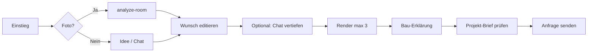

# Bärenwald GPT — Konzept „Projekt-Studio“ (neue Stufe)

> Stand: Juni 2026 · Bezug: `GPT_RAUMVISUALISIERUNG_IMPLEMENTIERUNG.md`  
> Ziel: GPT von **Text-Beratung** zu **sichtbarem Projekt-Briefing** heben — ohne CRM-Pflicht im MVP.

---

## 1. Ausgangslage

### Heute: Bärenwald GPT = Chat + Preis-CTA

| Was | Status |
|-----|--------|
| `KiRechnerChat` + `/api/ki-rechner` | Beratung, Gewerke, Ablauf, Preisrahmen |
| Einstieg | Portal, Partner, Rechner |
| Output | Strukturiertes `funnel_daten` → Lead / Rechner |
| Stärke | Vertrauen, Fachkompetenz, niedrige Hürde |
| Schwäche | **Abstrakt** — Kunde „sieht“ sein Projekt nicht |

### Geplant (Doku): Raumvisualisierung

| Was | Status |
|-----|--------|
| Tab „Raum visualisieren“ | Spezifikation fertig |
| Replicate + analyze-room | Noch nicht gebaut |
| Lead `gpt_raumvisualisierung` | Konzipiert |

**Lücke:** Zwei getrennte Welten (Chat vs. Viz) — Nutzer versteht nicht, dass das **ein Produkt** ist.

---

## 2. Die neue Idee: **Bärenwald Projekt-Studio**

### Elevator Pitch

> **„Zeig uns deinen Raum — wir zeigen dir den Umbau.“**  
> Nicht noch ein Chatbot, sondern ein **Projekt-Studio**: Beraten, Visualisieren, Anfragen — alles in **einem wachsenden Projekt-Brief**, den Bärenwald als GU versteht und der direkt als Anfrage landet.

### North Star

**Jede GPT-Session endet mit einem „Projekt-Brief“** — Text + optional Bilder + optional Visualisierung + Bau-Erklärung — den Vertrieb im CRM in **unter 30 Sekunden** versteht.

### Differenzierung vs. Wettbewerb

| Andere | Bärenwald Projekt-Studio |
|--------|--------------------------|
| ChatGPT: allgemeine Tipps | München-GU, Gewerke, Ablauf, GU-Verantwortung |
| Homestyler / RoomGPT: nur Bild | Bild **+** Bau-Erklärung **+** echte Anfrage |
| Rechner: Formular | Rechner **oder** freier Dialog **oder** Foto-Pfad |
| Makler-Visualisierung | **Handwerks-realistisch** (Umbau, nicht Deko) |

---

## 3. Produkt-Architektur: Drei Modi, ein Brief

```
┌─────────────────────────────────────────────────────────────┐
│                  Bärenwald Projekt-Studio                    │
├──────────────┬──────────────────────┬───────────────────────┤
│   BERATEN    │   VISUALISIEREN      │   ANFRAGEN            │
│   (heute)    │   (Doku / neu)       │   (gemeinsam)         │
├──────────────┼──────────────────────┼───────────────────────┤
│ Chat         │ Foto / Idee          │ Kontakt + PLZ         │
│ Gewerke      │ Vorher/Nachher       │ Lead persistLead      │
│ Preisrahmen  │ Stil + Nachprompt   │ CRM /anfragen         │
│              │ Bau-Erklärung        │                       │
└──────────────┴──────────────────────┴───────────────────────┘
                          │
                          ▼
              ┌───────────────────────┐
              │   Projekt-Brief       │
              │   (Session-State)     │
              │   • raum_typ          │
              │   • ist_beschreibung  │
              │   • wunsch_text       │
              │   • bilder[]          │
              │   • ergebnis_bild     │
              │   • gpt_erklaerung    │
              │   • chat_verlauf?     │
              └───────────────────────┘
```

### Kernprinzip: **Ein Brief, viele Einstiege**

- Wer mit **Chat** startet, kann später **„Raum zeigen“** — Brief wird angereichert, nicht neu gestartet.
- Wer mit **Foto** startet, kann danach **Fragen stellen** im gleichen Brief-Kontext.
- **Anfrage** zieht immer den **vollen Brief** — nicht nur den letzten Schritt.

Das ist die „neue Stufe“: nicht Feature 2 neben Feature 1, sondern **ein zusammenhängendes Projekt-Artefakt**.

---

## 4. UX-Konzept (Portal / Rechner / öffentlich)

### Shell: Tabs im GPT

| Tab | Inhalt | Priorität |
|-----|--------|-----------|
| **Beratung** | Bestehender `KiRechnerChat` | MVP (existiert) |
| **Raum visualisieren** | Flow aus Implementierungs-Doku | MVP Phase 1 |
| **Mein Projekt** *(neu)* | Live-Brief: Ist, Wunsch, Bilder, Erklärung | MVP Phase 1.5 |

**„Mein Projekt“** ist das Bindemittel — Sidebar oder dritter Tab, immer sichtbar ab erster Interaktion.

### Empfohlene User Journey (Happy Path)



### Micro-Copy (Marke)

- Nicht: „KI-Visualisierung“
- Sondern: **„So könnte dein Raum aussehen — und so bauen wir ihn.“**
- CTA Anfrage: **„Projekt an Bärenwald senden“** (nicht „Lead absenden“)

---

## 5. Technische Einordnung (nur handwerks-plattform)

### Session-Modell erweitern

Die Doku-Tabelle `gpt_raum_sessions` wird zum **`gpt_projekt_sessions`** (oder gleiche Tabelle + Felder):

```typescript
type GptProjektBrief = {
  session_id: string;
  // Visualisierung
  raum_analyse?: RaumAnalyseJson;
  wunsch_text?: string;
  ist_bilder_urls: string[];
  ergebnis_bild_url?: string;
  ergebnis_historie: RenderVersion[];
  gpt_erklaerung?: BauErklaerungJson;
  render_count: number;
  // Brücke zu Chat (Phase 1.5)
  ki_chat_verlauf?: ChatMessage[];
  funnel_handoff?: KiRechnerFunnelData;
  // Meta
  funnel_quelle: 'gpt_raumvisualisierung' | 'gpt_beratung' | 'gpt_kombiniert';
};
```

**`gpt_kombiniert`:** Chat + Viz in einer Session → stärkster Lead für Vertrieb.

### APIs (kumulativ zur Doku)

| Route | Neu/ bestehend |
|-------|----------------|
| `/api/gpt-viz/*` | Wie Doku |
| `GET /api/gpt-projekt/brief?sessionId=` | **Neu** — Brief für UI „Mein Projekt“ |
| `POST /api/gpt-projekt/merge-chat` | **Neu** — Chat-Verlauf an Session hängen |

### Lead-Erweiterung

```json
{
  "funnel_quelle": "gpt_kombiniert",
  "funnel_daten": {
    "projekt_studio": true,
    "raum_analyse": {},
    "wunsch_text": "",
    "ist_bilder_urls": [],
    "ergebnis_bild_url": "",
    "gpt_erklaerung": {},
    "ki_chat_verlauf": []
  }
}
```

PO aus Doku bleibt: **keine Extra-Intern-Mail** für Viz-Quellen.

---

## 6. Phasen-Roadmap

### Phase 0 — Fundament (1–2 Wochen)

- [ ] Lib `gpt-viz` + Migration `gpt_raum_sessions` (wie Doku)
- [ ] Tab-Shell in `PortalBaerenwaldGpt`: Beratung | Raum visualisieren
- [ ] Rate-Limits, Storage-Bucket

**Erfolg:** Tab wechselbar, Beratung unverändert.

### Phase 1 — „Wow“-Moment (2–3 Wochen)

- [ ] Vollständiger Viz-Flow (Doku 1:1)
- [ ] Lead `gpt_raumvisualisierung`
- [ ] Mobile im GPT-Sheet
- [ ] Öffentlicher Einstieg: Rechner-Link „Raum visualisieren“

**Erfolg:** Foto → Vorher/Nachher → Anfrage ohne Login.

### Phase 1.5 — Projekt-Brief (1 Woche)

- [ ] Tab / Panel **„Mein Projekt“**
- [ ] Session-ID in localStorage + optional Portal-Konto
- [ ] Brief-Vorschau vor Anfrage

**Erfolg:** Nutzer sieht zusammengefasst, was er absendet.

### Phase 2 — Verzahnung (2 Wochen)

- [ ] Chat → „Foto hinzufügen“ CTA im Chat
- [ ] Viz → „Noch Fragen?“ → Beratung mit Brief-Kontext
- [ ] `funnel_quelle: gpt_kombiniert`
- [ ] CRM (optional): Karte Vorher/Nachher in Anfrage-Detail

**Erfolg:** Ein durchgängiges Studio, nicht zwei Tools.

### Phase 3 — Intelligenz (Backlog)

- [ ] Preisrahmen aus `gpt_erklaerung` + `raum_analyse` (sanft, wie Ki-Rechner)
- [ ] Mehrere Räume pro Session (Wohnung)
- [ ] Partner-GPT: HW sieht anonymisierten Brief (ohne Kundendaten)
- [ ] Video/Walkthrough (langfristig)

---

## 7. PO-Entscheidungen (ergänzend zur Doku)

| Thema | Empfehlung |
|-------|------------|
| Name Produkt | **Projekt-Studio** (intern), UI: „Raum visualisieren“ + „Beratung“ |
| Session-Lebensdauer | 7 Tage (Doku) + localStorage-Wiederherstellung |
| Chat + Viz parallel | Phase 2 — MVP nur Tab-Wechsel, gleiche `session_id` wenn möglich |
| Partner-Portal GPT | Phase 3 — gleiche Engine, andere Prompts (Gewerk-Tipps) |
| Kosten Replicate | 3 Renders/Session, Monitoring €/Lead |
| Rechtliches | Hinweis: „KI-Visualisierung, keine Bauzeichnung“ + DSGVO Fotos |

---

## 8. CRM — was wann nötig ist

| Phase | CRM |
|-------|-----|
| 0–1 | **Nichts** — Lead in `leads` reicht |
| 2 | Optional: Anfrage-Detail Karte „KI-Visualisierung“ (Vorher/Nachher) |
| 3 | Optional: Brief als PDF für Angebotserstellung |

Vertrieb gewinnt schon in Phase 1, wenn `funnel_daten` die Bild-URLs enthält.

---

## 9. KPIs

| Metrik | Ziel Phase 1 |
|--------|----------------|
| Viz gestartet / Woche | Baseline messen |
| Foto → Render-Rate | > 40 % |
| Render → Anfrage-Rate | > 15 % |
| Zeit bis Anfrage | < 8 Min median |
| Lead-Qualität (CRM manuell) | „Bild hilfreich“ > 70 % |
| Kosten pro Lead (Replicate+Claude) | < X € (nach 4 Wochen definieren) |

---

## 10. Risiken & Gegenmaßnahmen

| Risiko | Gegenmaßnahme |
|--------|----------------|
| Schlechte Renders | analyze-room + Pflicht-Foto vor Render |
| Abbruch nach Render | Bau-Erklärung als Mehrwert vor Formular |
| Chat und Viz isoliert | Phase 1.5 Brief + Phase 2 Merge |
| API-Kosten | Hard-Cap 3 Renders, IP-Limits |
| Erwartung „fertige Planung“ | Copy: Inspiration, GU plant Details |

---

## 11. Empfehlung: Nächster konkreter Schritt

1. **Implementierungs-Doku umsetzen** (Phase 0+1) — technisch klar, PO fix.
2. **Parallel** Tab-Shell + Platzhalter „Mein Projekt“ — kommuniziert die Vision schon im UI.
3. **Nach erstem Render** intern 10 Test-Leads durchspielen mit Vertrieb — KPI „30-Sekunden-Verständnis“.

Die **neue Stufe** ist nicht einzeln die Visualisierung, sondern das **Projekt-Studio**: der erste Handwerks-GPT, der vom Gespräch **und** vom Bild zum **fertigen Projekt-Brief** führt — Bärenwald als GU, nicht als Spielzeug-App.

---

## 12. One-Liner für Marketing

**Vorher:** „Frag unseren Handwerks-Assistenten.“  
**Nachher:** „Lade ein Foto hoch — sieh deinen Umbau — versteh die Gewerke — sende dein Projekt an Bärenwald.“
