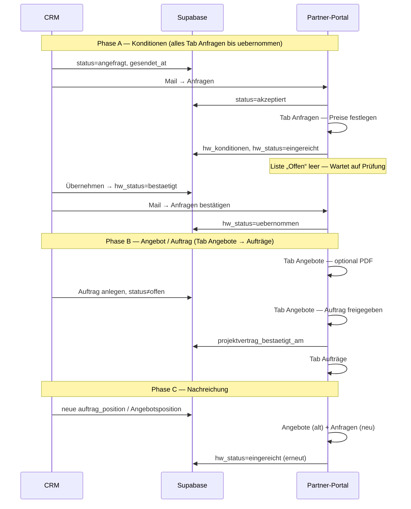

# Handwerker-Koordination — Prozess (Partner-Portal-Sicht)

**Stand:** Juni 2026  
**Single Source of Truth (Code):** `partner-portal-phase.ts`, `partner-anfrage-status.ts`, `partner-angebot-portal-status.ts`, `get-partner-data.ts`

CRM-Gegenstück: `baerenwald-crm-dashboard/docs/handwerker-koordination/HANDWERKER_KOORDINATION_PROZESS.md`

---

## 1. Drei Ebenen (nicht vermischen)

| Ebene | DB | Was Koordination daraus liest |
|-------|-----|-------------------------------|
| **Zuweisung** | `angebot_handwerker.status` | Hat HW die Anfrage angenommen? (`angefragt` / `akzeptiert` / `abgelehnt`) |
| **Konditionen** | `angebot_handwerker.hw_status` + `hw_konditionen` | Wo steht die Preisverhandlung? |
| **Bau** | `auftrag_positionen.leistung_status` | `offen` / `in_arbeit` / `erledigt` — nur CRM, kein Portal-Push |

Zusätzlich **Auftrags-Zuweisung** ohne Angebots-Funnel: `auftrag_positionen.handwerker_status` → eigener Eintrag unter Anfragen (`id=auftrag:{uuid}`).

---

## 2. Portal-Tabs vs. `hw_status`

### Wann erscheint ein `angebot_handwerker`-Vorgang in welchem Tab?

| `hw_status` | Zusatz | Tab(s) | Badge (Handwerker) | Aktion nötig? |
|-------------|--------|--------|-------------------|---------------|
| leer / offen | `status=angefragt`, keine `antwort_at` | **Anfragen** | Antwort ausstehend | Ja — annehmen/ablehnen |
| leer | `status=akzeptiert`, keine `hw_eingereicht_at` | **Anfragen** | Angebotspreis festlegen | Ja — Preise senden |
| `eingereicht` | | **Anfragen** *(nicht in „Offen“-Filter)* | Wartet auf Prüfung | Nein — CRM prüft |
| `bestaetigt` | | **Anfragen** | Konditionen bestätigen | Ja |
| `rueckfrage` / `abgelehnt` | | **Anfragen** | Neue Konditionen / abgelehnt | Ja |
| `uebernommen` | | **Angebote** | Warte auf Auftragsfreigabe | Optional PDF |
| `uebernommen` | `auftrag_status ≠ offen` | **Angebote** | Auftrag freigegeben | Ja — Vertrag + annehmen |
| `uebernommen` | `projektvertrag_bestaetigt_am` | **Aufträge** | Projektstatus | Ausführung |
| `uebernommen` | **+ Nachreichung** (neue Position) | **Angebote** + **Anfragen** | Angebote: Hinweis „Neue Leistung unter Anfragen“; Anfragen: „Neue Leistung“ | Ja — nur neue Zeile |

**Nachreichung:** Vorgang bleibt in **Angebote** (vereinbarte Leistungen). Zusätzlich erscheint er in **Anfragen** für die neue Leistung. Erkennung: `partner-konditionen.ts` (`hasPartnerKonditionenNachreichungAusstehend`), Quellen: `angebote.positionen` **und** `auftrag_positionen`.

---

## 3. Sequenzdiagramm (Portal-Sicht)

---

## 4. Schritte 0–10 (Portal-Bezug)

### Schritt 0 — Stammdaten

Portal: Registrierung `/partner/register` nur wenn Handwerker im CRM existiert.

### Schritt 1–2 — Zuweisen & Anfrage senden (CRM)

Portal: noch unsichtbar bis `gesendet_at` / `status=angefragt`.

**API:** `POST /api/internal/partner-notify-anfrage`  
**Link:** `?section=anfragen&id={angebot_handwerker.id}`

### Schritt 3 — Zu-/Absage

| Portal | Detail |
|--------|--------|
| Tab | **Anfragen** |
| Komponente | `PartnerAnfrageDetail.tsx` |
| Server | `respondPartnerAnfrage()` — `status`, `antwort_at` |

**Wichtig:** Nach Annahme bleibt der Eintrag in **Anfragen** (nicht Angebote).

### Schritt 4 — Konditionen einreichen

| Portal | Detail |
|--------|--------|
| Tab | **Anfragen** |
| Badge | „Angebotspreis festlegen“ |
| UI | `PartnerLeistungenKonditionenCard` — Annehmen / Preise senden |
| DB | `hw_konditionen`, `hw_status=eingereicht`, `hw_eingereicht_at` |

Optional: Angebots-PDF-Upload erst ab Tab **Angebote** (`hw_status=uebernommen`).

### Schritt 5 — CRM prüft (kein Portal-Schritt)

Portal: Eintrag mit `eingereicht` ist **nicht** in der Anfragen-Liste „Offen“ (Filter `isPartnerAnfrageAktionErforderlich`). Handwerker sieht ihn erst wieder bei `bestaetigt` oder per Direktlink.

### Schritt 6 — Konditionen bestätigen

| Portal | Detail |
|--------|--------|
| Tab | **Anfragen** |
| Badge | „Konditionen bestätigen“ |
| DB | `hw_status=uebernommen` (ein Klick, kein erneutes Preis-JSON) |

**API:** `POST /api/internal/partner-notify-angebot-bestaetigt` (`bitteBestaetigen: true`)

### Schritt 7 — Tab Angebote

| Unterphase | Badge | Aktion |
|------------|-------|--------|
| Warte Freigabe | Warte auf Auftragsfreigabe | Optional PDF (`submitPartnerAngebotPdf`) |
| CRM Transfer | Auftrag freigegeben | Rahmenvertrag, Unterlagen, **Auftrag annehmen** |

**Freigabe-Trigger:** `auftraege.status ≠ offen` — kein Portal-API-Call.

### Schritt 8 — Direkte Auftrags-Zuweisung

| Portal | Detail |
|--------|--------|
| Listen-ID | `auftrag:{auftrag_id}` |
| Tab | **Anfragen** solange `auftraege.status=offen` |
| Nach Annahme | ggf. verknüpftes `angebot_handwerker` → **Angebote** |

**API:** `POST /api/internal/partner-notify-zuweisung`

### Schritt 9 — Nachreichung

Siehe [KONDITIONEN_CRM_HANDOFF.md](../KONDITIONEN_CRM_HANDOFF.md) §6 und [HANDWERKER_KOORDINATION_PORTAL_UI.md](./HANDWERKER_KOORDINATION_PORTAL_UI.md).

Voraussetzungen: `hw_status=uebernommen`, `hw_konditionen` gesetzt, neue Position mit passender `handwerker_id` / Gewerk.

### Schritt 10 — Baufortschritt

Nur CRM (`leistung_status`). Portal **Aufträge** zeigt Projektstatus/Fortschritt indirekt.

---

## 5. APIs (CRM → Portal)

| Endpoint | Wann | Portal-Ziel |
|----------|------|-------------|
| `partner-notify-anfrage` | HW-Anfrage gesendet | Anfragen |
| `partner-notify-angebot-bestaetigt` | CRM Übernehmen | Anfragen (bestätigen) |
| `partner-notify-angebot-antwort` | CRM Rückfrage/Ablehnung | Anfragen |
| `partner-notify-zuweisung` | Zuweisung am Auftrag | Anfragen (`auftrag:…`) |
| *(keiner)* | Angebot → Auftrag Transfer | Angebote (Badge ändert sich) |

Details: [PARTNER_CRM_NOTIFY_API.md](../PARTNER_CRM_NOTIFY_API.md)

---

## 6. Code-Index (Portal)

| Bereich | Pfad |
|---------|------|
| Listen-Aufteilung | `get-partner-data.ts` |
| Phasen | `partner-portal-phase.ts` |
| Anfragen-Badges | `partner-anfrage-status.ts` |
| Angebote-Badges | `partner-angebot-portal-status.ts` |
| Nachreichung | `partner-konditionen.ts` |
| Anfrage-Detail | `PartnerAnfrageDetail.tsx` |
| Angebot-Detail | `PartnerAngebotDetail.tsx` |
| Auftrag-Detail | `PartnerAuftragDetail.tsx` |
| UI Shell | `PartnerClient.tsx` |

---

## 7. Bekannte UX-Lücken (Portal)

1. **`eingereicht` unsichtbar** in Anfragen-„Offen“ — Handwerker kann denken, alles erledigt; CRM muss innerhalb SLA reagieren oder Mail nutzen.
2. **Zwei Status-Ebenen** (`status` vs. `hw_status`) — in Schulung klar trennen.
3. **Nachreichung** erfordert korrekte `handwerker_id` / Gewerk — sonst keine Erkennung.
4. **CRM `createAuftragFromAngebot`** kann `bestaetigt` überspringen — Portal-Verhalten dann abweichend (Risiko in CRM-Doc §7).

---

## 8. Test-Auftrag

| Entität | ID |
|---------|-----|
| Auftrag (CRM) | `a5ebfa7d-b77a-4109-b68b-873896734f5d` |
| CRM-Tab | Leistungen & Steuerung (v2) |

Portal-Test: gleicher Handwerker einloggen → Tabs je `hw_status` durchklicken.
