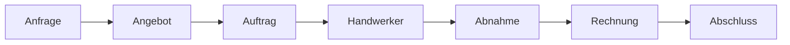
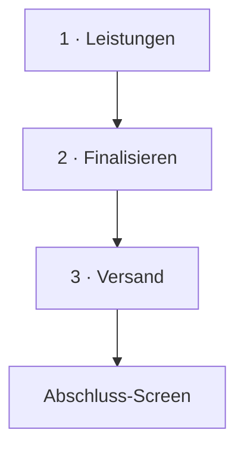
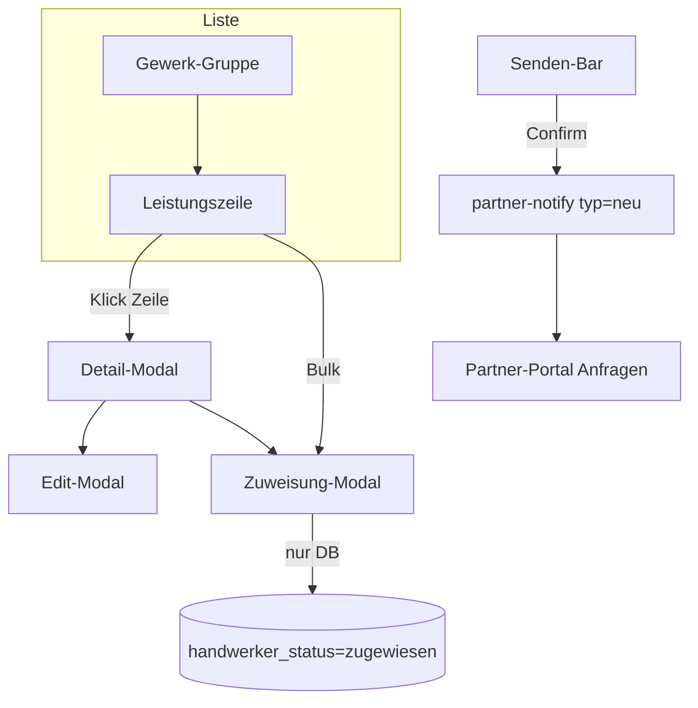
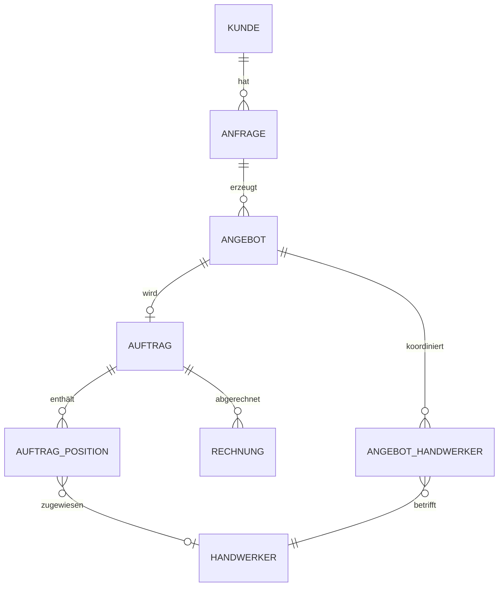

# Bärenwald CRM — Design-Audit & Fundament-Review

**Stand:** Juni 2026  
**Zielgruppe:** Product Designer, UX, Design Lead  
**Zweck:** Ein **einziger Einstiegspunkt**, um Flows, Prozesse, UI-Patterns, Ist-Zustand und Fundament-Lücken nachzuvollziehen — ohne den Code lesen zu müssen.

**Kernbefund:** Das CRM ist funktional breit aufgestellt, aber **visuell und strukturell noch kein skalierbares Produkt**. Viele Bereiche wurden iterativ gebaut (Legacy + v2 + v3 parallel). Das Fundament (Status-Logik, Detail-Screen-Pattern, Design Tokens, Mobile/Desktop-IA) muss **vor** weiterem Feature-Ausbau vereinheitlicht werden.

**Soll-Zustand (UI/UX-Zielbild):** [DESIGN_KONZEPT_CRM_UI_UX.md](./DESIGN_KONZEPT_CRM_UI_UX.md) — vollständiges Konzept für intuitive Navigation, Screens, Status und Umsetzungswellen.

---

## Inhaltsverzeichnis

1. [So nutzt du dieses Dokument](#1-so-nutzt-du-dieses-dokument)
2. [Executive Summary](#2-executive-summary)
3. [Produktkontext & Rollen](#3-produktkontext--rollen)
4. [Informationsarchitektur (Sitemap)](#4-informationsarchitektur-sitemap)
5. [End-to-End-Flows](#5-end-to-end-flows)
6. [Entitäten & Datenbeziehungen](#6-entitäten--datenbeziehungen)
7. [Status-System — das größte UX-Problem](#7-status-system--das-größte-ux-problem)
8. [Screen-Patterns (wie Screens aufgebaut sind)](#8-screen-patterns-wie-screens-aufgebaut-sind)
9. [Modul-Audit (Modul für Modul)](#9-modul-audit-modul-für-modul)
10. [Design System — Ist-Zustand](#10-design-system--ist-zustand)
11. [Skalierbarkeit & Fundament-Schulden](#11-skalierbarkeit--fundament-schulden)
12. [CRM ↔ Partner-Portal](#12-crm--partner-portal)
13. [Was existiert vs. was fehlt (Design-Handoff)](#13-was-existiert-vs-was-fehlt-design-handoff)
14. [Empfohlene Design-Phasen (Roadmap)](#14-empfohlene-design-phasen-roadmap)
15. [Prioritäten: Fundament vor Features](#15-prioritäten-fundament-vor-features)
16. [Verweise & Detail-Dokumentation](#16-verweise--detail-dokumentation)
17. [Anhang](#17-anhang)

---

## 1. So nutzt du dieses Dokument

| Wenn du … | Lies zuerst … |
|-----------|----------------|
| Den Gesamtprozess verstehen willst | [§5 End-to-End-Flows](#5-end-to-end-flows) |
| Einen konkreten Screen redesignen willst | [§9 Modul-Audit](#9-modul-audit-modul-für-modul) + zugehörige Detail-Docs |
| Farben, Typo, Komponenten brauchst | [§10 Design System](#10-design-system--ist-zustand) |
| Verstehen willst, warum Nutzer verwirrt sind | [§7 Status-System](#7-status-system--das-größte-ux-problem) |
| Prioritäten für Redesign setzen willst | [§15 Prioritäten](#15-prioritäten-fundament-vor-features) |

**Live testen:** Dev-Server typisch `localhost:3001` · Test-Auftrag Positions-Tab: `/auftraege/a5ebfa7d-b77a-4109-b68b-873896734f5d`

**Screenshots (Handwerker-Bereich):** `docs/handwerker-koordination/screenshots/` · statische Referenz: `docs/handwerker-koordination/ui-referenz.html`

---

## 2. Executive Summary

### Was das Produkt ist

Ein **B2B-CRM für Bauprojekte / Handwerkskoordination**: Leads erfassen → Angebot erstellen → Auftrag abwickeln → Handwerker koordinieren → abnehmen → abrechnen. Parallel existiert ein **Partner-Portal** für Handwerker (Anfragen, Konditionen, Verträge, Compliance).

### Warum es „zu voll“ wirkt

| Symptom | Ursache im Produkt |
|---------|-------------------|
| Jeder Screen hat viele Tabs, Cards, Badges | Fachliche Komplexität + historisch gewachsene Features ohne IA-Reduktion |
| Gleiche Aktion, unterschiedliche UI | 3 Generationen Positions-UI (Accordion → v2 Tabs → v3 Modals) |
| Desktop ≠ Mobile | Eigene Tab-Sets, andere Default-Tabs, andere Labels |
| Status unklar | 6+ parallele Status-Felder (Lead, Angebot, Auftrag, Leistung, Handwerker, Partner) |
| Wizards vs. Pages | Angebot/Rechnung als Modal, Anfrage neu als Page |
| Versteckte Module | Formulare, Preislisten ohne Sidebar-Eintrag |

### Design-Diagnose in einem Satz

> **Die Oberfläche spiegelt die Datenbank — nicht den Nutzer-Job.**

Nutzer denken in **„Was ist der nächste Schritt?“**; das UI zeigt **Entitäten, Felder und parallele Status**.

### Was „Fundament optimieren“ bedeutet (Design-Sicht)

1. **Eine sichtbare Status-Ebene** pro Kontext (nicht 3 Badges pro Zeile)
2. **Ein Detail-Screen-Pattern** für alle Entitäten (gleiche Tab-Logik Desktop/Mobile)
3. **Ein Positions-/Leistungs-Pattern** (v3 als Richtung, Legacy entfernen)
4. **Design Tokens dokumentieren** (Figma ↔ Code)
5. **Flow-first IA**: Navigation folgt Pipeline, nicht Modul-Liste

---

## 3. Produktkontext & Rollen

### Primäre Nutzer (CRM)

| Rolle | Typische Jobs |
|-------|----------------|
| **Vertrieb / Innendienst** | Anfragen qualifizieren, Angebote erstellen, Kundenkommunikation |
| **Projektleitung** | Auftrag steuern, Handwerker zuweisen, Termine, Baustelle |
| **Backoffice / Finanzen** | Rechnungen, Zahlungsplan, Abschluss |
| **Admin** | Einstellungen, Gewerke, Team, Compliance, DSGVO |

### Sekundäre Nutzer (Partner-Portal)

| Rolle | Jobs |
|-------|------|
| **Handwerker / Subunternehmer** | Anfrage annehmen, Preise einreichen/bestätigen, Vertrag, Compliance-Dokumente |

### Shell-Layout (CRM)

```
┌─────────────────────────────────────────────────────────────┐
│ TopBar (Titel, Suche, KI, Benachrichtigungen)               │
├──────────┬──────────────────────────────────────────────────┤
│ Sidebar  │  Hauptinhalt                                     │
│ (Desktop)│  · Listen: Master-Detail ab 900px                │
│          │  · Details: Head + Tabs + Cards                    │
│          │  · Wizards: oft als Fullscreen-Modal             │
├──────────┴──────────────────────────────────────────────────┤
│ BottomNav + FAB (Mobile, ≤768px typisch)                    │
└─────────────────────────────────────────────────────────────┘
```

**Code:** `src/components/layout/` · Navigation: `src/lib/nav-config.ts`

---

## 4. Informationsarchitektur (Sitemap)

### Sidebar (Desktop) — 4 Gruppen

| Gruppe | Module | Route |
|--------|--------|-------|
| **Arbeit** | Dashboard | `/` |
| | Anfragen | `/anfragen` |
| | Angebote | `/angebote` |
| | Aufträge | `/auftraege` |
| **Stammdaten** | Kunden | `/kunden` |
| | Handwerker | `/handwerker` |
| | Partner | `/partner` |
| **Finanzen** | Rechnungen | `/rechnungen` |
| **Planung** | Kalender | `/kalender` |
| | KI Hub | `/ki-analytics` |
| **Footer** | Einstellungen | `/einstellungen` |

### Mobile Bottom Nav (nur 4 + „Mehr“)

Dashboard · Anfragen · Angebote · Aufträge → Rest unter **Mehr-Sheet**

### Wichtige Routen **ohne** Sidebar

| Route | Problem für IA |
|-------|----------------|
| `/formulare/*` | Formular-Builder — nur über Einstellungen erreichbar |
| `/preislisten` | Doppelt zu `/einstellungen/preise` und `/einstellungen/preisliste` |
| `/auftraege/[id]/finanzen` | Finanzen auch als Tab im Auftrag — doppelter Einstieg |
| `/auftraege/[id]/abschluss` | Abschluss-Flow neben Tab „Nächste Schritte“ |

### Einstellungen (14+ Unterseiten)

Profil · Firma · Team · Gewerke · Felder · Vorlagen · Preise · Preisliste · Formulare · E-Mail · Textbausteine · Integration · Compliance · Datenschutz

**Design-Hinweis:** Einstellungen sind **Admin-Schublade** — ok, aber Preis-Themen 3× verwirrend.

---

## 5. End-to-End-Flows

### 5.1 Haupt-Pipeline (Happy Path)



| Phase | Screen(s) | Nutzer-Aktion | System-Effekt |
|-------|-----------|---------------|---------------|
| **1. Anfrage** | `/anfragen/neu` → `/anfragen/[id]` | Lead erfassen, Termin, Notizen | Status: neu → kontaktiert → … |
| **2. Angebot** | Modal: `AngebotWizard` (3 Schritte) | Leistungen, Finalisieren, Versand | PDF, Mail, Status gesendet |
| **3. Auftrag** | `/auftraege/[id]` | „Annehmen & Auftrag anlegen“ aus Angebot | Sync Positionen, ProjektKette |
| **4. Handwerker** | Tab **Positionen** im Auftrag | Zuweisen → Senden | DB + Partner-Mail |
| **5. Ausführung** | Positionen (Baufortschritt), Baustelle-Tab | Offen / In Arbeit / Erledigt | Fortschritt % auf Auftrag |
| **6. Abnahme** | `/auftraege/[id]/abnahme/*` | Protokoll, Mängel | Punch List |
| **7. Rechnung** | `RechnungWizard` (Modal) | Leistungen wählen, Versand | Rechnungs-PDF |
| **8. Abschluss** | `/auftraege/[id]/abschluss` | Dokumentation, Archiv | Auftrag abgeschlossen |

**Visuelle Kette im UI:** `ProjektKette` (Kunde → Anfrage → Angebot → Auftrag → Rechnung) auf Detail-Screens.

---

### 5.2 Anfrage-Detail — Tabs

| Tab | Inhalt |
|-----|--------|
| Nächste Schritte | `NaechsteSchritteCard` — Handlungsempfehlungen |
| Schritte / Pipeline | Lead-Status-Fortschritt |
| Verlauf | Timeline |
| Notizen | Freitext |
| Dokumente | Uploads |

**Mobile:** zusätzlicher Tab **Stammdaten** (Desktop: feste Übersicht oben).

**Code:** `src/components/anfragen/AnfrageDetailClient.tsx`

---

### 5.3 Angebot-Wizard — 3 Schritte



| Schritt | UI-Inhalt |
|---------|-----------|
| **Leistungen** | Gewerke, Positionen, Fotos, optional KI-Visualisierung |
| **Finalisieren** | Gültigkeit, Zahlungsplan, Mail-Texte, §35a/§13b |
| **Versand** | Empfänger, PDF-Vorschau, Senden |

**Shell:** Fullscreen-Modal (`AppFlowScreen`) · Auto-Save ab Schritt 3  
**Code:** `src/components/angebote/AngebotWizard.tsx`

**Hinweis:** `AngebotWizardHandwerkerStep.tsx` existiert, ist **nicht** im Wizard — HW-Zuweisung passiert in Leistungen/Gewerke, nicht als eigener Schritt.

---

### 5.4 Auftrag-Detail — Tabs (aktuell)

#### Desktop (Default: **Nächste Schritte**)

Feste Übersicht (immer sichtbar): Projektübersicht · Stammdaten · Kommunikation

| Tab | Label Desktop | Inhalt |
|-----|---------------|--------|
| `baustelle`* | Baustelle | Bautagebuch, Regiearbeiten |
| `leistung` | Positionen | **Leistungen v3** (flache Liste + Modals) |
| `schritte` | Nächste Schritte | NaechsteSchritteCard |
| `aktivitaet` | Verlauf | Timeline |
| `dokumente` | Dokumente | Verträge, PDFs |
| `compliance` | Compliance | Partner-Dokumente |
| `finanzen` | Finanzen | Zahlungsplan, Finanzen |

\* nur bei Bauprojekt

#### Mobile (Default: **Stammdaten**)

Zusätzlicher Tab `stammdaten` · gleiche Inhalte, andere Priorität.

**Code:** `src/components/auftraege/AuftragDetailClient.tsx`

---

### 5.5 Handwerker-Koordination (Auftrag Tab Positionen) — v3

**Zielbild (Juni 2026, implementiert):**



| Aktion | UI | Mail? |
|--------|-----|-------|
| Handwerker zuweisen | Zuweisung-Modal (EK + HW-Liste) | Nein |
| An Handwerker senden | Sticky Senden-Bar | Ja |
| Leistung bearbeiten (HW schon dran) | Edit-Modal | Ja (`typ=geaendert`) |
| Baufortschritt | Status-Pill Dropdown in Zeile | Nein |

**Detail-Prozess:** `docs/handwerker-koordination/HANDWERKER_KOORDINATION_PROZESS.md`  
**UI-Analyse (historisch v2, teils veraltet):** `docs/handwerker-koordination/HANDWERKER_KOORDINATION_UI_ANALYSE.md`

**Legacy noch im Repo (deprecated, nicht löschen):**
- `AuftragPositionenSteuerungTabLegacy.tsx`
- `AuftragPositionDetailPanel.tsx` (v2, 3 Tabs)
- `AuftragPositionenMobile.tsx`
- `HandwerkerEinreichungPruefung.tsx` / `HwKonditionenPruefungTable.tsx`

---

### 5.6 Rechnung-Wizard — 3 Schritte

Analog Angebot: Leistungen → Details → Versand · Modal aus Auftrag oder `/rechnungen/neu`  
**Code:** `src/components/rechnungen/RechnungWizard.tsx`

---

## 6. Entitäten & Datenbeziehungen



**Designer-relevant:** Nutzer sehen diese Kette als `ProjektKette` — aber **Handwerker-Status** lebt an 2–3 Stellen gleichzeitig (siehe §7).

---

## 7. Status-System — das größte UX-Problem

### Problem

Mehrere **parallele Status-Welten** konkurrieren in Badges, Farben und Kopfzeilen. Nutzer können „grün“ sehen, obwohl fachlich noch etwas offen ist — oder umgekehrt.

### Status-Ebenen (vereinfacht)

| Ebene | Feld / Konzept | Wo sichtbar | Beispiel-Werte |
|-------|-----------------|-------------|----------------|
| **Lead** | Anfrage-Status | Anfrage-Detail, Listen | neu, kontaktiert, termin, angebot, auftrag |
| **Angebot (DB)** | `angebote.status` | Angebot-Detail (technisch) | entwurf, gesendet_handwerker, kunde_akzeptiert, … |
| **Angebot (UI)** | `status_einfach` | Badge vereinfacht | entwurf, gesendet, angenommen, abgelehnt |
| **Auftrag** | `auftraege.status` | Auftrag-Head | offen, in_arbeit, abgeschlossen |
| **Leistung** | `leistung_status` | Positions-Zeile (Pill) | offen, in_arbeit, erledigt |
| **HW Zuweisung** | `handwerker_status` (Position) | HW-Chip / implizit | zugewiesen, angefragt, bestätigt, … |
| **Partner-Anfrage** | `angebot_handwerker.status` | selten direkt sichtbar | ausstehend, … |
| **Partner-Konditionen** | `angebot_handwerker.hw_status` | Gegenvorschlag-Flow (Legacy UI) | eingereicht, bestaetigt, uebernommen |
| **Compliance** | diverse | Compliance-Tab | offen, geprüft, … |

### Was Designer definieren sollten: Status-Matrix

Für **jede Entität** eine Tabelle (Beispiel-Vorlage):

| DB-Wert | UI-Label | Farbe | Icon? | Nächste Aktion (CTA) | Für wen sichtbar |
|---------|----------|-------|-------|----------------------|------------------|
| `zugewiesen` | „Zugewiesen, nicht gesendet“ | neutral | ○ | „An Handwerker senden“ | Projektleitung |

**Empfehlung:** Max. **1 primärer Status** + optional **1 sekundärer Hinweis** pro Zeile/Screen — nicht 3 Badges.

### Badge-Komponenten im Code (Fragmentierung)

- `StatusBadge`, `AngebotStatusBadge`, `AngebotEinfachStatusBadge`
- `AuftragStatusBadge`, `LeistungStatusPill` (v3)
- CSS: `.badge-new`, `.badge-offer`, `.pos-v2-badge-*`, `.pos-v3-status-pill`

**Design-Aufgabe:** Badge-System **konsolidieren** (1 Komponente, semantische Varianten).

---

## 8. Screen-Patterns (wie Screens aufgebaut sind)

### 8.1 Listen-Screens

| Pattern | Beschreibung | Breakpoint |
|---------|--------------|------------|
| **Master-Detail** | Liste links, Detail rechts | ab **900px** |
| **Mobile Liste** | Vollbreite, Tap → Detail-Page | <900px |
| **Toolbar** | Filter, Suche, Sort | `.list-toolbar` (kompakt 30px Desktop) |

**Betroffene Module:** Anfragen, Angebote, Aufträge, Kunden  
**Code:** `AppMasterDetailLayout`, `*MasterDetailShell`

**Inkonsistenz:** Tailwind `md:` = 768px, Master-Detail = 900px → **Tablet-Lücke**.

---

### 8.2 Detail-Screens

Standard-Aufbau:

```
DetailHead (Titel, Status-Badge, Actions-Menü)
ProjektKette (wenn Pipeline-Entität)
[Feste Übersicht-Cards — Desktop]
DetailTabBar
Tab-Inhalt (Cards, Tabellen, EmptyStates)
Modals / Wizards (overlay)
```

**Code:** `DetailHead`, `DetailTabBar`, `DetailResponsiveTabs`, `Card`

---

### 8.3 Wizards

| Wizard | Container | Schritte |
|--------|-----------|----------|
| Angebot | Fullscreen-Modal | 3 |
| Rechnung | Fullscreen-Modal | 3 |
| Projektvertrag | Modal | variabel |
| Anfrage neu | **eigene Page** | 1 Form |

**UX-Problem:** Unterschiedliche „Raumgefühl“ — Designer sollten **eine Wizard-Shell** definieren (Modal vs. Route).

---

### 8.4 Modals & Sheets (parallel)

| Typ | Verwendung |
|-----|------------|
| `Modal` | Standard-Dialog |
| `FormSheet` | Seitliches Formular |
| `MobileEditSheet` | Mobile Bearbeitung |
| `ActionSheet` | Mobile Aktionen |

**Design-Aufgabe:** Wann welches Pattern? Aktuell **ad hoc**.

---

## 9. Modul-Audit (Modul für Modul)

Legende: 🔴 kritisch · 🟠 hoch · 🟡 mittel · 🟢 ok

| Modul | Reife | Hauptprobleme | Design-Fokus |
|-------|-------|---------------|--------------|
| **Dashboard** | 🟡 | Viele Widgets, KPI ohne klare Priorität | Tages-Cockpit: „Was muss ich heute tun?“ |
| **Anfragen** | 🟢 | Relativ konsistent, FAB auf Mobile | Lead-Status vereinfachen |
| **Angebote** | 🟠 | Wizard gut, Detail überladen, Tab-Dopplung Desktop/Mobile | Angebot-Detail entflechten |
| **Aufträge** | 🔴 | Meiste Tabs, HW-Komplexität, v1/v2/v3 | **Positionen v3 polish**, Tab-IA vereinheitlichen |
| **Handwerker (Stamm)** | 🟡 | Kein Master-Detail wie andere | An Auftrag-Pattern angleichen |
| **Kunden** | 🟢 | Standard-Pattern | — |
| **Rechnungen** | 🟡 | Wizard ok, Finanzen doppelt geroutet | Ein Einstieg Finanzen |
| **Kalender** | 🟡 | isoliert | Pipeline-Verknüpfung |
| **KI Hub** | 🟡 | Feature-Insel | Klare Abgrenzung vs. Dashboard |
| **Einstellungen** | 🟠 | 14+ Seiten, Preis 3× | IA-Gruppierung, Suche |
| **Formulare** | 🔴 | versteckt, Builder komplex | Eigenes Admin-Pattern |
| **Partner (CRM)** | 🟡 | vs. Partner-Portal unklar | Begriffsklärung Partner vs. Handwerker |
| **Compliance** | 🟠 | über Auftrag, HW, Einstellungen verteilt | End-to-End-Flow designen |

---

### 9.1 Auftrag — vertieft (wichtigster Screen)

**Warum kritisch:** Hier laufen Leistungen, Handwerker, Finanzen, Compliance, Dokumente zusammen.

| Bereich | Ist | Soll (Design-Richtung) |
|---------|-----|------------------------|
| Tab **Positionen** | v3 flache Liste + Modals | ✅ Richtung gut — polish: Typo, Spacing, leere Zustände, Mobile |
| Tab **Nächste Schritte** | Checkliste | Sollte **Einstieg** sein (Desktop Default ok) |
| Tab **Baustelle** | nur Bauprojekt | Conditional Tab ok — visuell kennzeichnen |
| Tab **Compliance** | Checklisten | Mit Portal-Status verknüpfen |
| Tab **Finanzen** | + Route `/finanzen` | **Ein** Einstieg |
| Handwerker-Gegenvorschlag | Legacy-Komponenten deprecated | Neues Pattern oder Portal-only |

---

### 9.2 Angebot — vertieft

| Bereich | Problem |
|---------|---------|
| Detail-Tabs | Desktop `positionen` vs. Mobile `leistung` — gleicher Inhalt |
| Status | DB-Status vs. `status_einfach` — zwei Wahrheiten |
| HW im Wizard | Kein dedizierter Schritt, aber fachlich relevant |
| Visualisierung | eigene Route `/visualisierung` — Flow-Anbindung unklar |

---

## 10. Design System — Ist-Zustand

### 10.1 Farben (Tailwind `bw-*`)

| Token | Hex | Verwendung |
|-------|-----|------------|
| `bw-primary` | `#2E7D52` | Primär, Links, aktive States |
| `bw-dark` / Sidebar | `#1A3D2B` | Navigation |
| `bw-accent` | `#C4922A` | FAB, Akzente |
| `bw-green-bg` | `#EAF3DE` | Hintergründe, Card-Heads |
| `bw-text` | `#14181F` | Body |
| `bw-text-muted` | `#6B7280` | Sekundärtext |
| Status-* | diverse | Pipeline-Badges |

**Legacy-Aliase (noch im Code):** `primary`, `ink`, `surface`, `muted` — **Drift-Risiko**

**Quelle:** `tailwind.config.ts` · Komponenten-CSS: `src/app/globals.css` (~4400 Zeilen)

---

### 10.2 Typografie

- System-Font-Stack (Apple/Segoe/Roboto)
- Basis **14px**, klein **12–13px**, viele **10–11px** in Tabellen (Positions-Zeilen)
- **Problem:** Zu viele Größenstufen ohne dokumentiertes Scale

---

### 10.3 Komponenten-Inventar (`src/components/ui/`)

| Kategorie | Komponenten |
|-----------|-------------|
| Actions | `Button`, `ActionsMenu` |
| Layout | `Card`, `Modal`, `FormSheet`, `EmptyState`, `Skeleton` |
| Navigation | `DetailTabBar`, `Sidebar` (layout) |
| Feedback | `app-toast`, Badges (mehrere) |
| Forms | `Input`, `Select`, `input-label`, `.txt-prefix` (€-Felder) |

**Button-Dualität:** React `<Button variant="primary">` **und** `<button className="btn btn-primary">` — gleiches Aussehen, unterschiedliche API.

---

### 10.4 CSS-Generationen (Positions-UI)

| Generation | CSS-Präfix | Status |
|------------|------------|--------|
| Legacy Accordion | diverse | Mobile-Reste |
| v2 | `.pos-v2-*` | deprecated, noch CSS |
| v3 | `.pos-v3-*` | **aktiv** |

**Design-Aufgabe:** v2-CSS nach v3-Migration entfernen · Figma nur **eine** Positions-Komponente.

---

### 10.5 Interne UI-Roadmap (Code)

`src/lib/design-system/phases.ts` — Phasen A/B/C als **done** markiert (Fundament, Cockpit, Navigation).

**Realität:** Phasen adressierten **Polish**, nicht **strukturelle IA/Status-Vereinheitlichung**. Neue Phase D–F nötig (siehe §14).

---

## 11. Skalierbarkeit & Fundament-Schulden

### Warum nicht skalierbar (Design-Sicht)

| Schuld | Folge für neues Design |
|--------|------------------------|
| Keine Figma Source of Truth | Jeder Screen einzeln im Code nachbauen |
| Status nicht modelliert | Jedes Feature erfindet neue Badges |
| Desktop/Mobile divergent | 2× Design pro Screen |
| 3 Positions-UI-Generationen | Designer patcht falsche Version |
| Globals.css monolithisch | Token-Änderung bricht unbekannte Stellen |
| Versteckte Routen | IA wächst unkontrolliert |
| Partner + CRM getrennt dokumentiert | HW-Flows unvollständig im Review |

### Was „Fundament optimieren“ **nicht** heißt

- Nicht: noch mehr Tabs/Cards pro Screen
- Nicht: weitere Badge-Farben
- Nicht: Feature-first ohne Pattern

### Was es **heißt**

1. **Design Tokens** → Figma Variables ↔ Tailwind
2. **Pattern Library** → 5–7 Shells (Liste, Detail, Wizard, Modal, Empty, Error, Loading)
3. **Status-Matrix** → Product + Design + Dev gemeinsam
4. **Mobile-first IA** → gleiche Tab-Namen, gleiche Defaults
5. **Legacy entfernen** → nach v3-Stabilisierung (Design begleitet Migration)

---

## 12. CRM ↔ Partner-Portal

Handwerker-Flows sind **dual**:

| Schritt | CRM | Partner-Portal |
|---------|-----|----------------|
| Zuweisen | Auftrag Tab Positionen | — |
| Senden | „An Handwerker senden“ | Mail → Anfragen |
| Preise einreichen | (Legacy Gegenvorschlag-UI) | Portal Formular |
| CRM übernimmt | (deprecated Prüfung) | wartet Bestätigung |
| Vertrag / Compliance | Auftrag Tabs | Portal Bereiche |

**Checkliste:** `docs/CRM_PARTNER_FLOW_CHECKLIST.md`  
**Einreichung:** `docs/HANDWERKER_ANGEBOT_EINREICHUNG.md`

**Design-Aufgabe:** **Journey Map CRM + Portal** als eine Figur — sonst redesignet man halbe Wahrheit.

---

## 13. Was existiert vs. was fehlt (Design-Handoff)

### ✅ Vorhanden

| Artefakt | Ort |
|----------|-----|
| Handwerker-Prozess (fachlich) | `docs/handwerker-koordination/HANDWERKER_KOORDINATION_PROZESS.md` |
| Handwerker-UI-Analyse (teils v2) | `docs/handwerker-koordination/HANDWERKER_KOORDINATION_UI_ANALYSE.md` |
| Statische UI-Referenz Positions | `docs/handwerker-koordination/ui-referenz.html` |
| Screenshots (HW) | `docs/handwerker-koordination/screenshots/` |
| Partner-Flow-Checkliste | `docs/CRM_PARTNER_FLOW_CHECKLIST.md` |
| Tailwind-Farben | `tailwind.config.ts` |
| UI-Komponenten (Code) | `src/components/ui/` |
| **Dieses Audit** | `docs/DESIGN_AUDIT_CRM_FUNDAMENT.md` |

### ❌ Fehlt (dringend für Designer)

| Artefakt | Nutzen |
|----------|--------|
| **Figma Library** | Source of Truth |
| **Design Tokens Doc** (Spacing, Radius, Shadow, Type Scale) | Handoff ohne globals.css lesen |
| **Status-Matrix** (alle Entitäten) | Kernproblem lösen |
| **Breakpoint-Spec** (768 vs 900 vs 1024) | Responsive konsistent |
| **Pattern Spec** Detail-Screen (Desktop + Mobile) | Alle Entitäten gleich |
| **Wizard Shell Spec** | Angebot, Rechnung, Vertrag |
| **Empty / Error / Loading Katalog** | Edge Cases |
| **Aktuelle v3-Screenshots** | Review ohne Login |
| **Partner-Portal Screens** | Vollständige HW-Journey |
| **Komponenten-Mapping Figma ↔ Code** | Dev-Übergabe |

---

## 14. Empfohlene Design-Phasen (Roadmap)

### Phase D — Fundament (4–6 Wochen Design)

- Status-Matrix + Badge-System (1 Komponente)
- Design Tokens in Figma
- Detail-Screen Pattern (1 Spec für Anfrage/Angebot/Auftrag)
- Breakpoint-Entscheidung (900px vereinheitlichen oder bewusst dokumentieren)

### Phase E — Kernflows (6–8 Wochen)

- Auftrag Tab **Positionen v3** — final polish + alle Zustände
- Angebot-Wizard + Angebot-Detail — entflechten
- Handwerker-Journey CRM + Portal — eine Journey Map
- Rechnung + Finanzen — ein Einstieg

### Phase F — Konsolidierung (4 Wochen)

- Legacy-UI visuell entfernen (Accordion, v2)
- Einstellungen IA
- Empty/Error/Loading überall
- Accessibility-Pass (Fokus, Kontrast, Touch Targets Mobile)

---

## 15. Prioritäten: Fundament vor Features

| Prio | Thema | Begründung |
|------|-------|------------|
| **P0** | Status-Matrix + Badge-Konsolidierung | Verwirrung überall |
| **P0** | Auftrag Positionen v3 — Design abschließen | Größter operativer Screen |
| **P1** | Detail-Tabs Desktop = Mobile (Namen, Defaults) | Lernkurve halbieren |
| **P1** | Wizard-Shell vereinheitlichen | Orientierung |
| **P1** | Design Tokens / Figma Library | Skalierung |
| **P2** | Finanzen-Einstieg bereinigen | Doppelroute |
| **P2** | Einstellungen / Preis-IA | Admin-Verwirrung |
| **P2** | Partner-Journey Map | HW-Flow vollständig |
| **P3** | Formulare-Builder | Nischen-Admin |
| **P3** | KI Hub Abgrenzung | Nice-to-have Polish |

---

## 16. Verweise & Detail-Dokumentation

| Thema | Dokument |
|-------|----------|
| **UI/UX Soll-Konzept (Zielbild)** | [DESIGN_KONZEPT_CRM_UI_UX.md](./DESIGN_KONZEPT_CRM_UI_UX.md) |
| Handwerker-Prozess (fachlich) | [HANDWERKER_KOORDINATION_PROZESS.md](./handwerker-koordination/HANDWERKER_KOORDINATION_PROZESS.md) |
| Handwerker-UI Ist/Ziel v2 | [HANDWERKER_KOORDINATION_UI_ANALYSE.md](./handwerker-koordination/HANDWERKER_KOORDINATION_UI_ANALYSE.md) |
| CRM ↔ Portal Checkliste | [CRM_PARTNER_FLOW_CHECKLIST.md](./CRM_PARTNER_FLOW_CHECKLIST.md) |
| HW-Angebot Einreichung | [HANDWERKER_ANGEBOT_EINREICHUNG.md](./HANDWERKER_ANGEBOT_EINREICHUNG.md) |
| HW-Zuweisung & Bauprojekt (Handoff) | [CRM_HANDOFF_HW_BAUAUFTRAG.md](./CRM_HANDOFF_HW_BAUAUFTRAG.md) |
| Positions v3 Code | `src/components/auftraege/leistungen-v3/` |
| Navigation | `src/lib/nav-config.ts` |
| UI-Roadmap (Code) | `src/lib/design-system/phases.ts` |

---

## 17. Anhang

### A. Vollständige Routenliste (CRM)

```
/                           Dashboard
/anfragen                   Anfragen-Liste
/anfragen/neu               Neue Anfrage
/anfragen/[id]              Anfrage-Detail
/anfragen/[id]/angebote     Angebote der Anfrage
/angebote                   Angebots-Liste
/angebote/neu               Angebot anlegen
/angebote/[id]              Angebot-Detail
/angebote/[id]/bearbeiten   Wizard Bearbeitung
/angebote/[id]/visualisierung
/auftraege                  Auftrags-Liste
/auftraege/[id]             Auftrag-Detail ★
/auftraege/[id]/finanzen
/auftraege/[id]/abschluss
/auftraege/[id]/abnahme/*
/auftraege/[id]/rechnungen-auswahl
/rechnungen                 Rechnungs-Liste
/rechnungen/neu             Rechnungs-Wizard
/rechnungen/[id]
/kunden / kunden/[id]
/handwerker / handwerker/[id]
/partner / partner/[id]
/kalender
/ki-analytics
/preislisten                (ohne Sidebar)
/formulare/*                (ohne Sidebar)
/einstellungen/*            14+ Subseiten
/login
```

### B. Wichtige Code-Orte für Designer-Review

| Bereich | Pfad |
|---------|------|
| App-Shell | `src/components/layout/` |
| Anfrage-Detail | `src/components/anfragen/AnfrageDetailClient.tsx` |
| Angebot-Wizard | `src/components/angebote/AngebotWizard.tsx` |
| Angebot-Detail | `src/components/angebote/AngebotDetailPageClient.tsx` |
| Auftrag-Detail | `src/components/auftraege/AuftragDetailClient.tsx` |
| Positionen v3 | `src/components/auftraege/leistungen-v3/AuftragLeistungenV3Tab.tsx` |
| Design-CSS | `src/app/globals.css` |
| Farb-Tokens | `tailwind.config.ts` |

### C. Test-Daten

| Was | ID / URL |
|-----|----------|
| Test-Auftrag | `a5ebfa7d-b77a-4109-b68b-873896734f5d` |
| Positionen-Tab | `/auftraege/a5ebfa7d-b77a-4109-b68b-873896734f5d` → Tab Positionen |

### D. Glossar

| Begriff | Bedeutung |
|---------|-----------|
| **Leistung / Position** | Einzelposten im Auftrag (Gewerk + Name + VK/EK) |
| **Gewerk** | Trade (Elektro, Sanitär, …) |
| **Partner** | Externer Handwerker im Portal |
| **ProjektKette** | Breadcrumb Kunde → Anfrage → Angebot → Auftrag → Rechnung |
| **VK** | Verkaufspreis netto (`preis_fix`) |
| **EK** | Einkauf / Partnerpreis (`preis_partner`) |
| **v3** | Aktuelle flache Positions-Liste mit Modals |

---

*Erstellt als zentrales Design-Audit für das Bärenwald CRM. Bei Fragen zu Implementierungsdetails: zugehörige Detail-Docs oder Code-Pfade in §16/§17.*
