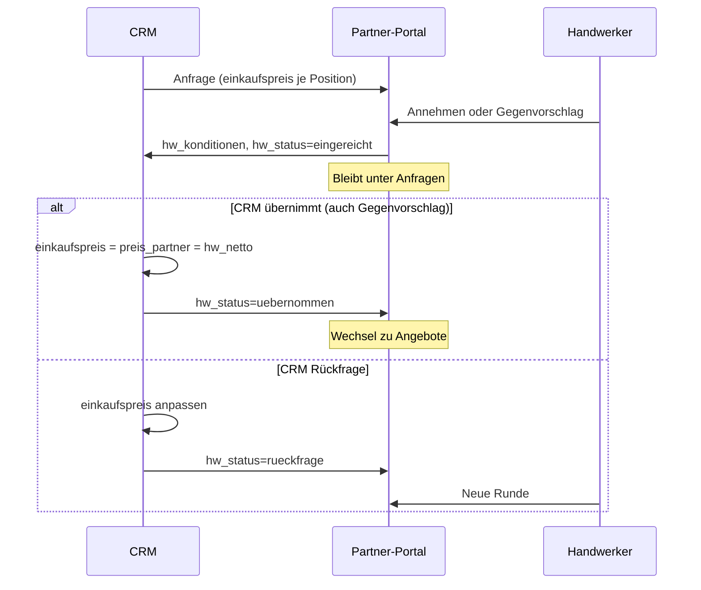

# Konditionen-Workflow — SQL & CRM-To-dos

Stand: 25.06.2026  
Zielgruppe: **baerenwald-crm-dashboard** + Supabase-Betrieb

---

## 1. Was im Partner-Portal bereits fertig ist

| Bereich | Status | Dateien |
|---------|--------|---------|
| EK-Vorschlag je Leistung (readonly in Anfrage) | ✅ | `partner-konditionen.ts`, `partner-leistungen-display.ts` |
| Konditionen-Card (eine Tabelle) | ✅ | `PartnerLeistungenKonditionenCard.tsx` |
| Anfrage: annehmen / Gegenvorschlag (Preis-Popup) | ✅ | `PartnerAnfrageDetail.tsx`, `respondPartnerAnfrage()` |
| Anfrage bleibt bis HW-Bestätigung (`hw_status` bestaetigt → uebernommen) | ✅ | `partner-portal-phase.ts` |
| Angebot: eine Spalte „Vergütung netto“ + optionales PDF | ✅ | `PartnerAngebotDetail.tsx`, `submitPartnerAngebotPdf()` |
| Auftrag: vereinbarter Partnerpreis | ✅ | `PartnerAuftragDetail.tsx` |
| E-Mail mit Positions-Tabelle | ✅ | `partner-mail.ts` |

---

## 2. Preis-Modell (Grundsatz)

**Nach Preiseinigung gibt es nur einen Netto-Preis je Leistung — kein getrennter EK und Partnerpreis.**

| Phase | Bedeutung | Wo gespeichert |
|-------|-----------|----------------|
| Vorschlag | Bärenwald schlägt Vergütung vor | `angebote.positionen[].einkaufspreis` (× `menge` = Zeile netto) |
| Verhandlung | HW bestätigt oder Gegenvorschlag | `angebot_handwerker.hw_konditionen` (`ek_netto` = Snapshot, `hw_netto` = HW-Vorschlag) |
| **Vereinbart** | Einigung steht | **gleicher Wert** in `einkaufspreis` **und** `preis_partner` |

### Felder nach „Übernehmen“ (CRM)

| Feld | Tabelle | Einheit | Wert nach Einigung |
|------|---------|---------|-------------------|
| `einkaufspreis` | `angebote.positionen` (JSON) | **pro Einheit** netto | `hw_netto / menge` |
| `preis_partner` | `auftrag_positionen` | **Zeile** netto | `hw_netto` |
| `hw_preis_netto` / `hw_preis_brutto` | `angebot_handwerker` | Gesamt | Summe der Zeilen |
| `hw_konditionen` | `angebot_handwerker` | JSON | Historie der Runde (unverändert lassen) |

**Wichtig:** `ek_netto` in `hw_konditionen` ist nur der **Stand bei Einreichung** (Vergleich für die Prüf-UI). Der **lebende** Einkaufspreis ist nach Übernahme `einkaufspreis` in den Angebotspositionen — identisch zur Partnervergütung.

---

## 3. SQL (Supabase)

**Migration:** `supabase/migrations/20260704120000_partner_hw_konditionen.sql`

```sql
alter table public.angebot_handwerker
  add column if not exists hw_konditionen jsonb;

comment on column public.angebot_handwerker.hw_konditionen is
  'HW-Konditionen: { art: bestaetigt|gegenvorschlag, positionen: [{ position_id, leistung, ek_netto, hw_netto, mwst_satz, geaendert }], eingereicht_at }';
```

**Reihenfolge:** Nr. 8 in [SUPABASE_PARTNER_PORTAL_SQL.md](./SUPABASE_PARTNER_PORTAL_SQL.md).

**JSON-Schema `hw_konditionen` (Verhandlungs-Snapshot):**

```json
{
  "art": "gegenvorschlag",
  "eingereicht_at": "2026-06-25T12:00:00.000Z",
  "positionen": [
    {
      "position_id": "uuid-der-crm-position",
      "leistung": "Fliesen legen",
      "ek_netto": 450.0,
      "hw_netto": 480.0,
      "mwst_satz": 19,
      "geaendert": true
    }
  ]
}
```

| Feld | Bedeutung |
|------|-----------|
| `art` | `bestaetigt` = HW hat Vorschlag unverändert angenommen; `gegenvorschlag` = mind. eine Zeile geändert |
| `ek_netto` | Vorschlag Bärenwald **zum Zeitpunkt der Einreichung** (Zeile netto); `null` = „Preis folgt“ |
| `hw_netto` | Vom Handwerker eingereicht (Zeile netto) — **Basis für die Einigung** |
| `geaendert` | `true` wenn `hw_netto ≠ ek_netto` |

**Status `angebot_handwerker.hw_status`:**

| Wert | Bedeutung | Partner-Tab |
|------|-----------|-------------|
| `offen` | HW hat noch nicht geantwortet | Anfragen |
| `eingereicht` | HW hat zugesagt / Gegenvorschlag — CRM prüft | Anfragen |
| `bestaetigt` | **CRM hat eingewilligt** — HW muss vereinbarte Preise noch bestätigen | Anfragen (offen) |
| `uebernommen` | **HW hat bestätigt** — Angebots-PDF, Vertrag | Angebote (offen bis CRM Auftrag freigibt) |
| `rueckfrage` | CRM lehnt ab / neuer Vorschlag — HW kann erneut antworten | Anfragen |
| `abgelehnt` | CRM lehnt endgültig ab (optional → Rückfrage-Runde) | Anfragen |

**Drei Schritte nach Gegenvorschlag:**

1. CRM akzeptiert → `hw_status = bestaetigt` (+ Preise in DB schreiben) → Partner **Anfragen / offen**
2. HW bestätigt → `hw_status = uebernommen` → Partner **Angebote / offen** (PDF-Upload möglich)
3. CRM nimmt Auftrag an (`auftraege.status` ≠ `offen`) → **Angebote geschlossen** → Partner **Aufträge**

---

## 4. Gegenvorschlag — CRM-Ablauf

### 4.1 Was der Handwerker sendet

1. Unter **Anfragen** Preise prüfen, ggf. per Popup **„Preis bearbeiten“** anpassen.
2. **Annehmen** → `art: bestaetigt`, alle `hw_netto = ek_netto`.
3. **Gegenvorschlag senden** → `art: gegenvorschlag`, mind. eine Zeile `geaendert: true`.
4. Portal setzt: `status = akzeptiert`, `hw_status = eingereicht`, `hw_konditionen`, Summen.

### 4.2 Prüf-UI im CRM

- [ ] `hw_konditionen` laden und Tabelle anzeigen:

  | Leistung | Vorschlag (ek_netto) | HW (hw_netto) | Δ | Geändert |
  |----------|----------------------|---------------|---|----------|

- [ ] Badge: **Bestätigt** vs. **Gegenvorschlag** (`art`)
- [ ] Gesamtsumme aus `hw_preis_netto` / `hw_preis_brutto`
- [ ] Bei Gegenvorschlag: Δ hervorheben (z. B. amber), Sortierung nach größter Abweichung

### 4.3 Entscheidungen des CRM

| Aktion | Wann | Ergebnis |
|--------|------|----------|
| **Übernehmen (Gegenvorschlag)** | Einigung mit HW-Preisen | `hw_status = bestaetigt`, **ein** Preis je Zeile in DB, Mail „bitte bestätigen“ |
| **Übernehmen (unverändert)** | HW hat Vorschlag bestätigt | optional direkt `uebernommen` oder ebenfalls `bestaetigt` |
| **Rückfrage** | Neuer Bärenwald-Vorschlag, Verhandlung geht weiter | `einkaufspreis` in Positionen anpassen, `hw_status = rueckfrage` |
| **Ablehnen** | Keine Einigung | `hw_status = abgelehnt` oder `rueckfrage` + Notiz |

**Regel Gegenvorschlag:** Übernahme bedeutet **nicht** „EK behalten und Partnerpreis separat“. Es bedeutet: **Der vereinbarte Netto-Preis ist `hw_netto` — und wird als einziger Wert in EK und Partnerpreis geschrieben.**

---

## 5. Aktion „Übernehmen“ (Implementierung CRM)

Nur bei `hw_status === 'eingereicht'`.

### 5.1 Pseudocode je Position

```typescript
for (const pos of hw_konditionen.positionen) {
  const vereinbartNettoZeile = pos.hw_netto; // einzige Wahrheit nach Einigung
  const menge = positionAusAngebot(pos.position_id).menge ?? 1;

  // 1) Angebotsposition — Einkaufspreis = Partnervergütung (pro Einheit)
  updateAngebotPosition(pos.position_id, {
    einkaufspreis: round2(vereinbartNettoZeile / menge),
    // Optional: lohn_netto + material_netto auf 0 oder Aufteilung — aber Summe × menge = vereinbartNettoZeile
  });

  // 2) Auftragsposition (falls Auftrag schon existiert)
  updateAuftragPosition(pos.position_id, {
    preis_partner: vereinbartNettoZeile,
  });
}

updateAngebotHandwerker(anfrageId, {
  hw_status: 'bestaetigt', // NICHT uebernommen — HW bestätigt erst im Portal
  hw_crm_antwort_at: now(),
  hw_crm_notiz: optional,
});

// Mail: POST /api/internal/partner-notify-angebot-bestaetigt
// Body: { anfrageId, bitteBestaetigen: true }
```

### 5.2 SQL-Beispiel (Angebotspositionen im JSON `angebote.positionen`)

```sql
-- Vereinbarten Netto-Preis in die Angebotsposition schreiben (JSON-Array positionen)
-- position_id und hw_netto aus hw_konditionen.positionen[]
-- einkaufspreis := hw_netto / menge  (Portal rechnet: einkaufspreis * menge = Zeile netto)
```

> **Implementierungshinweis:** `angebote.positionen` ist JSONB — im CRM per App-Logik patchen (nicht blind SQL), damit `position_id` sicher gematcht wird.

### 5.3 SQL-Beispiel Auftragsposition

```sql
update public.auftrag_positionen
set preis_partner = :hw_netto_zeile
where id = :position_id;
-- preis_partner = Zeilen-Netto (wie Portal buildPartnerAuftragKonditionZeilen erwartet)
```

### 5.4 Nach CRM-Übernahme (`bestaetigt`)

- [ ] Partner-Portal: Eintrag bleibt unter **Anfragen** (Filter „offen“, Badge „Gegenangebot akzeptiert“)
- [ ] HW sieht vereinbarte Preise (readonly) und Button **„Vereinbarte Konditionen bestätigen“**
- [ ] Mail mit `bitteBestaetigen: true` (Link zu Anfragen)
- [ ] `hw_konditionen` als Historie **nicht löschen**

### 5.5 Nach HW-Bestätigung (`uebernommen`)

- [ ] Partner-Portal: Eintrag wechselt zu **Angebote** (offen, solange `auftraege.status = offen`)
- [ ] HW kann optional Angebots-PDF hochladen
- [ ] Nach CRM-Auftragsfreigabe: Angebote **geschlossen**, Vorgang unter **Aufträge**

---

## 6. Aktion „Rückfrage“ (neue Verhandlungsrunde)

Wenn der Gegenvorschlag **nicht** übernommen wird, aber weiterverhandelt werden soll:

1. [ ] Neuen Bärenwald-Vorschlag in `angebote.positionen[].einkaufspreis` setzen (× `menge` = neues `ek_netto` für nächste Runde).
2. [ ] `hw_status = 'rueckfrage'`, `hw_crm_notiz` mit Begründung (z. B. „Max. 460 € netto möglich“).
3. [ ] **Nicht** `preis_partner` setzen — noch keine Einigung.
4. [ ] HW sieht unter **Anfragen** die neue Rückfrage, kann erneut annehmen oder Gegenvorschlag senden (überschreibt `hw_konditionen`).

---

## 7. CRM-To-dos (Checkliste)

### Prüf-UI
- [ ] `HandwerkerEinreichungPruefung.tsx`: `hw_konditionen` + Δ-Tabelle
- [ ] Buttons: Übernehmen | Rückfrage | Ablehnen

### Übernehmen
- [ ] `einkaufspreis` und `preis_partner` auf **denselben** vereinbarten Netto-Wert (`hw_netto`)
- [ ] `hw_status = uebernommen`
- [ ] Gesamtsummen konsistent (`hw_preis_*` bereits vom Portal)

### Rückfrage
- [ ] Nur `einkaufspreis` anpassen, `hw_status = rueckfrage`
- [ ] Kein `preis_partner` bis zur finalen Einigung

### Auftragsphase
- [ ] Rechnungs-Upload erst nach `uebernommen` + Vertrag (Portal bereits so)

### Edge Cases
- [ ] `ek_netto: null` bei Einreichung → Übernahme = `hw_netto` wird erster EK
- [ ] Mehrere `angebot_handwerker` pro Gewerk: Filter `gewerk_id` + `handwerker_id`
- [ ] Audit: `hw_crm_antwort_at`, User-ID

---

## 8. Status-Flow



---

## 9. Test-Checkliste

1. HW nimmt EK an → CRM übernimmt → `einkaufspreis × menge = preis_partner` = `hw_netto`
2. HW sendet Gegenvorschlag (+30 €) → CRM übernimmt → **beide** Felder = neuer HW-Preis, nicht alter EK
3. CRM Rückfrage mit neuem EK → HW sieht Anfrage, kann erneut antworten
4. Nach `uebernommen` → nur Tab **Angebote**, eine Vergütungsspalte, optional PDF
5. Auftrag zeigt `preis_partner` = vereinbarter Wert aus Schritt 1/2
