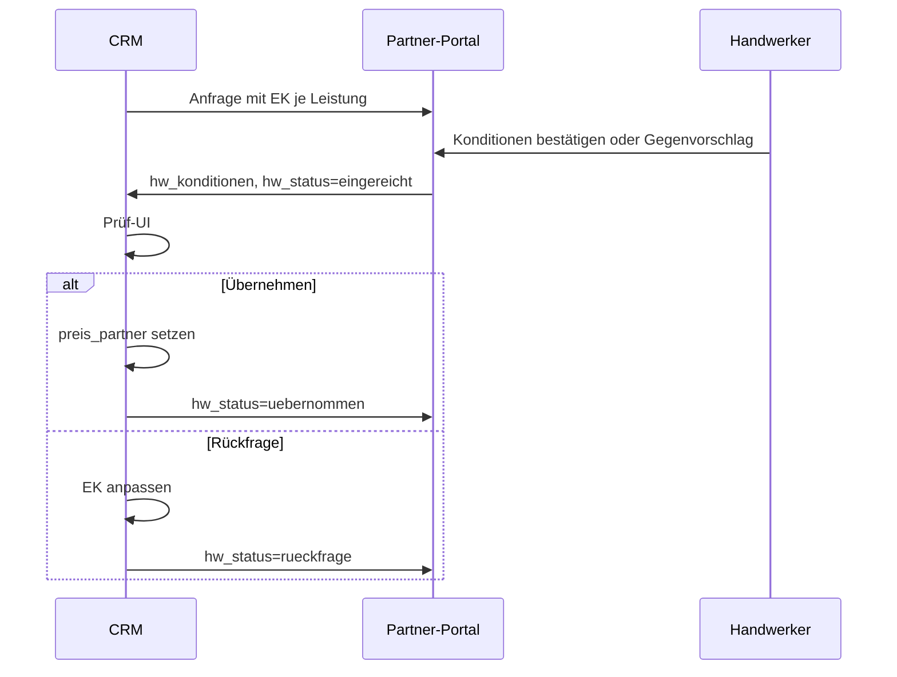

# Konditionen-Workflow — SQL & CRM-To-dos

Stand: 25.06.2026  
Zielgruppe: **baerenwald-crm-dashboard** + Supabase-Betrieb

---

## 1. Was im Partner-Portal bereits fertig ist

| Bereich | Status | Dateien |
|---------|--------|---------|
| EK-Vorschlag je Leistung (readonly) | ✅ | `partner-konditionen.ts`, `partner-leistungen-display.ts` |
| Konditionen-Card (eine Tabelle) | ✅ | `PartnerLeistungenKonditionenCard.tsx` |
| Angebot: bestätigen / Gegenvorschlag | ✅ | `PartnerAngebotDetail.tsx`, `submitPartnerKonditionen()` |
| Anfrage: readonly Konditionen | ✅ | `PartnerAnfrageDetail.tsx` |
| Auftrag / Auftrags-Anfrage: Leistungen | ✅ | `PartnerAuftragDetail.tsx`, `PartnerAuftragAnfrageDetail.tsx` |
| PDF bei Angebot optional | ✅ | `partner-upload-limits.ts`, `partner-angebote.ts` |
| E-Mail mit Positions-Tabelle | ✅ | `partner-mail.ts` |

---

## 2. SQL (Supabase)

**Migration:** `supabase/migrations/20260704120000_partner_hw_konditionen.sql`

```sql
-- Partner-Portal: Konditionen je Leistung (HW bestätigt oder Gegenvorschlag)

alter table public.angebot_handwerker
  add column if not exists hw_konditionen jsonb;

comment on column public.angebot_handwerker.hw_konditionen is
  'HW-Konditionen: { art: bestaetigt|gegenvorschlag, positionen: [{ position_id, leistung, ek_netto, hw_netto, mwst_satz, geaendert }], eingereicht_at }';
```

**Reihenfolge:** Nr. 8 in [SUPABASE_PARTNER_PORTAL_SQL.md](./SUPABASE_PARTNER_PORTAL_SQL.md).

**JSON-Schema `hw_konditionen`:**

```json
{
  "art": "bestaetigt",
  "eingereicht_at": "2026-06-25T12:00:00.000Z",
  "positionen": [
    {
      "position_id": "uuid-der-crm-position",
      "leistung": "Fliesen legen",
      "beschreibung": "optional",
      "ek_netto": 450.0,
      "hw_netto": 450.0,
      "mwst_satz": 19,
      "geaendert": false
    }
  ]
}
```

- `art`: `bestaetigt` (alle Zeilen = EK) oder `gegenvorschlag` (mind. eine Zeile `geaendert: true`)
- `ek_netto`: Einkaufspreis-Vorschlag Bärenwald (netto Zeile); `null` wenn „Preis folgt“
- `hw_netto`: vom Handwerker eingereicht (netto Zeile)
- Bei Einreichung setzt das Portal zusätzlich: `hw_status = eingereicht`, `hw_preis_netto` / `hw_preis_brutto` (Summen), optional `hw_angebot_pdf_url` / Anhänge

**Bestehende Spalten (unverändert genutzt):**

| Spalte | Rolle |
|--------|--------|
| `hw_status` | `offen` → `eingereicht` → `uebernommen` / `rueckfrage` / `abgelehnt` |
| `hw_preis_netto`, `hw_preis_brutto` | Gesamtsumme der HW-Konditionen |
| `preis_partner` (Auftragsposition) | **Partnerpreis nach CRM-Übernahme** |

---

## 3. CRM-To-dos (baerenwald-crm-dashboard)

### 3.1 Prüf-UI für eingereichte Konditionen

- [ ] In `HandwerkerEinreichungPruefung.tsx` (o. ä.) `hw_konditionen` aus `angebot_handwerker` laden und parsen
- [ ] Tabelle je Position: Leistung | EK netto | HW netto | Δ | geändert
- [ ] Gesamtsumme netto/brutto anzeigen (aus JSON oder `hw_preis_*`)
- [ ] Badge: „Bestätigt“ vs. „Gegenvorschlag“ (`art`)
- [ ] Optional: eingereichtes PDF (`hw_angebot_pdf_url`) nur anzeigen, nicht als Pflicht

### 3.2 Aktion „Übernehmen“

- [ ] Button nur bei `hw_status === eingereicht`
- [ ] Pro Zeile in `hw_konditionen.positionen`: `preis_partner = hw_netto` auf passender Auftragsposition schreiben (Match über `position_id` oder Leistung+Gewerk)
- [ ] `angebot_handwerker.hw_status = uebernommen`
- [ ] `hw_crm_antwort_at`, optional `hw_crm_notiz` setzen
- [ ] Partner-Mail: Konditionen übernommen → Vertrag / Auftrag freischalten (bestehende Flows anbinden)

### 3.3 Aktion „Rückfrage / Ablehnung“

- [ ] EK in CRM-Positionen anpassen (neuer `einkaufspreis` / `lohn_netto` + `material_netto`)
- [ ] `hw_status = rueckfrage`, `hw_crm_notiz` mit Begründung
- [ ] `hw_konditionen` optional leeren oder als Historie behalten (Produktentscheidung)
- [ ] Handwerker erneut einladen / Status auf `offen` für neue Runde (falls gewünscht)

### 3.4 Auftragsphase

- [ ] Nach `uebernommen`: Auftragspositionen zeigen `preis_partner` (bereits Portal-seitig für HW)
- [ ] Rechnungs-Upload im Portal erst bei `hw_status === uebernommen` (bereits umgesetzt)

### 3.5 Edge Cases

- [ ] Zeilen ohne EK (`ek_netto: null`): CRM muss EK nachziehen oder HW-Gegenvorschlag als Basis nehmen
- [ ] Mehrere `angebot_handwerker` pro Gewerk: Filter wie im Portal (`gewerk_id`, `handwerker_id`)
- [ ] Audit: wer hat übernommen/abgelehnt (`hw_crm_antwort_at`, User-ID falls vorhanden)

---

## 4. Status-Flow (Übersicht)



---

## 5. Test-Checkliste (CRM + Portal)

1. Anfrage mit EK → HW sieht „Vorschlag netto“, kann bestätigen
2. Zeile ohne EK → „Preis folgt“, HW kann Gegenvorschlag eintragen
3. Einreichung ohne PDF → erfolgreich
4. CRM übernimmt → Auftrag zeigt Partnerpreis
5. CRM Rückfrage → HW sieht CRM-Notiz, kann erneut einreichen
