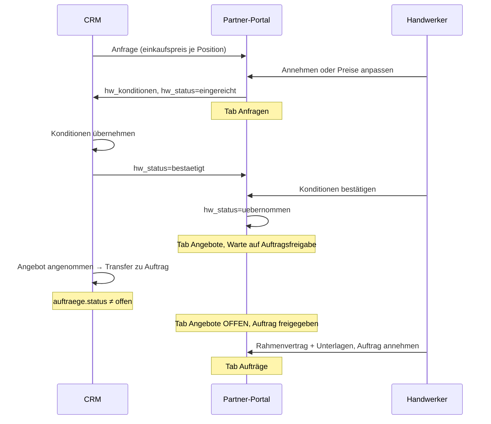

# Konditionen-Workflow — SQL & CRM-To-dos

Stand: 25.06.2026  
Zielgruppe: **baerenwald-crm-dashboard** + Supabase-Betrieb

---

## 1. Was im Partner-Portal bereits fertig ist

| Bereich | Status | Dateien |
|---------|--------|---------|
| EK-Vorschlag je Leistung (readonly in Anfrage) | ✅ | `partner-konditionen.ts`, `partner-leistungen-display.ts` |
| Konditionen-Card (eine Tabelle) | ✅ | `PartnerLeistungenKonditionenCard.tsx` |
| Anfrage: annehmen / Preise anpassen | ✅ | `PartnerAnfrageDetail.tsx`, `respondPartnerAnfrage()` |
| Anfrage bleibt bis HW-Bestätigung (`hw_status` bestaetigt → uebernommen) | ✅ | `partner-portal-phase.ts` |
| Angebot: eine Spalte „Vergütung netto“ + optionales PDF | ✅ | `PartnerAngebotDetail.tsx`, `submitPartnerAngebotPdf()` |
| Auftrag: vereinbarter Partnerpreis | ✅ | `PartnerAuftragDetail.tsx` |
| E-Mail mit Positions-Tabelle | ✅ | `partner-mail.ts` |

---

## 2. Preis-Modell (Grundsatz)

**Nach Preiseinigung gibt es nur einen Netto-Preis je Leistung — kein getrennter EK und Partnerpreis.**

| Phase | Bedeutung | Wo gespeichert |
|-------|-----------|----------------|
| Vorschlag | Bärenwald schlägt Vergütung vor | `angebote.positionen[].einkaufspreis` (× `menge` = Zeile netto) |
| Verhandlung | HW bestätigt oder passt Preise an | `angebot_handwerker.hw_konditionen` |
| **Vereinbart** | Einigung steht | **gleicher Wert** in `einkaufspreis` **und** `preis_partner` |

### Felder nach „Übernehmen“ (CRM)

| Feld | Tabelle | Einheit | Wert nach Einigung |
|------|---------|---------|-------------------|
| `einkaufspreis` | `angebote.positionen` (JSON) | **pro Einheit** netto | `hw_netto / menge` |
| `preis_partner` | `auftrag_positionen` | **Zeile** netto | `hw_netto` |
| `hw_preis_netto` / `hw_preis_brutto` | `angebot_handwerker` | Gesamt | Summe der Zeilen |
| `hw_konditionen` | `angebot_handwerker` | JSON | Historie der Runde (unverändert lassen) |

**Wichtig:** `ek_netto` in `hw_konditionen` ist nur der **Stand bei Einreichung** (Vergleich für die Prüf-UI). Der **lebende** Einkaufspreis ist nach Übernahme `einkaufspreis` in den Angebotspositionen — identisch zur Partnervergütung.

---

## 3. SQL (Supabase)

**Migration:** `supabase/migrations/20260704120000_partner_hw_konditionen.sql`

```sql
alter table public.angebot_handwerker
  add column if not exists hw_konditionen jsonb;

comment on column public.angebot_handwerker.hw_konditionen is
  'HW-Konditionen: { art: bestaetigt|gegenvorschlag, positionen: [{ position_id, leistung, ek_netto, hw_netto, mwst_satz, geaendert }], eingereicht_at }';
```

**Reihenfolge:** Nr. 8 in [SUPABASE_PARTNER_PORTAL_SQL.md](./SUPABASE_PARTNER_PORTAL_SQL.md).

**JSON-Schema `hw_konditionen` (Verhandlungs-Snapshot):**

```json
{
  "art": "gegenvorschlag",
  "eingereicht_at": "2026-06-25T12:00:00.000Z",
  "positionen": [
    {
      "position_id": "uuid-der-crm-position",
      "leistung": "Fliesen legen",
      "ek_netto": 450.0,
      "hw_netto": 480.0,
      "mwst_satz": 19,
      "geaendert": true
    }
  ]
}
```

| Feld | Bedeutung |
|------|-----------|
| `art` | `bestaetigt` = HW hat Vorschlag unverändert angenommen; `gegenvorschlag` = mind. eine Zeile geändert |
| `ek_netto` | Vorschlag Bärenwald **zum Zeitpunkt der Einreichung** (Zeile netto); `null` = „Preis folgt“ |
| `hw_netto` | Vom Handwerker eingereicht (Zeile netto) — **Basis für die Einigung** |
| `geaendert` | `true` wenn `hw_netto ≠ ek_netto` |

**Status `angebot_handwerker.hw_status`:**

| Wert | Bedeutung | Partner-Tab |
|------|-----------|-------------|
| `offen` | HW hat noch nicht geantwortet | Anfragen |
| `eingereicht` | HW hat geantwortet — CRM prüft | Anfragen |
| `bestaetigt` | **CRM hat eingewilligt** — HW muss vereinbarte Preise noch bestätigen | Anfragen (offen) |
| `uebernommen` | **HW hat Konditionen bestätigt** — wartet auf CRM-Auftragsfreigabe | Angebote (geschlossen bis Freigabe) |
| `rueckfrage` | CRM lehnt ab / neuer Vorschlag — HW kann erneut antworten | Anfragen |
| `abgelehnt` | CRM lehnt endgültig ab (optional → Rückfrage-Runde) | Anfragen |

**Vier Schritte bis zum laufenden Auftrag:**

1. CRM akzeptiert Konditionen → `hw_status = bestaetigt` (+ Preise in DB) → Partner **Anfragen / offen**
2. HW bestätigt → `hw_status = uebernommen` → Partner **Angebote / geschlossen** (Badge: „Warte auf Auftragsfreigabe“, optional PDF)
3. **CRM: Angebot angenommen → Transfer zu Auftrag** → `auftraege.status` ≠ `offen` → Partner **Angebote / offen** (Badge: „Auftrag freigegeben“)
4. HW nimmt Auftrag an (Rahmenvertrag + Unterlagen) → `projektvertrag_bestaetigt_am` → Partner **Aufträge**

---

## 4. Konditionen-Runde (CRM)

Ein Prozess für Zuweisung, Annahme und Preisverhandlung — kein Sonderfall.

### 4.1 Handwerker (Portal)

1. Preise prüfen, ggf. „Preis bearbeiten“.
2. **Annehmen** → `art: bestaetigt` · **Preise senden** → `art: gegenvorschlag`.
3. Portal setzt `hw_status = eingereicht`.

### 4.2 CRM-Prüfung

- Tabelle: Vorschlag (`ek_netto`) vs. HW (`hw_netto`), Δ bei Abweichung
- Badge nach `art`: unverändert / angepasst

### 4.3 CRM-Entscheidung

| Aktion | Ergebnis |
|--------|----------|
| **Übernehmen** | `hw_status = bestaetigt`, ein Preis je Zeile in DB, Notify-Mail |
| **Rückfrage** | neuer Vorschlag in Positionen, `hw_status = rueckfrage` |
| **Ablehnen** | `hw_status = abgelehnt` |

Nach Übernahme: `hw_netto` = einziger Wert in `einkaufspreis` und `preis_partner`.
---

## 5. Aktion „Übernehmen“ (Implementierung CRM)

Nur bei `hw_status === 'eingereicht'`.

### 5.1 Pseudocode je Position

```typescript
for (const pos of hw_konditionen.positionen) {
  const vereinbartNettoZeile = pos.hw_netto; // einzige Wahrheit nach Einigung
  const menge = positionAusAngebot(pos.position_id).menge ?? 1;

  // 1) Angebotsposition — Einkaufspreis = Partnervergütung (pro Einheit)
  updateAngebotPosition(pos.position_id, {
    einkaufspreis: round2(vereinbartNettoZeile / menge),
    // Optional: lohn_netto + material_netto auf 0 oder Aufteilung — aber Summe × menge = vereinbartNettoZeile
  });

  // 2) Auftragsposition (falls Auftrag schon existiert)
  updateAuftragPosition(pos.position_id, {
    preis_partner: vereinbartNettoZeile,
  });
}

updateAngebotHandwerker(anfrageId, {
  hw_status: 'bestaetigt', // NICHT uebernommen — HW bestätigt erst im Portal
  hw_crm_antwort_at: now(),
  hw_crm_notiz: optional,
});

// Mail: POST /api/internal/partner-notify-angebot-bestaetigt
// Body: { anfrageId, bitteBestaetigen: true }
```

### 5.2 SQL-Beispiel (Angebotspositionen im JSON `angebote.positionen`)

```sql
-- Vereinbarten Netto-Preis in die Angebotsposition schreiben (JSON-Array positionen)
-- position_id und hw_netto aus hw_konditionen.positionen[]
-- einkaufspreis := hw_netto / menge  (Portal rechnet: einkaufspreis * menge = Zeile netto)
```

> **Implementierungshinweis:** `angebote.positionen` ist JSONB — im CRM per App-Logik patchen (nicht blind SQL), damit `position_id` sicher gematcht wird.

### 5.3 SQL-Beispiel Auftragsposition

```sql
update public.auftrag_positionen
set preis_partner = :hw_netto_zeile
where id = :position_id;
-- preis_partner = Zeilen-Netto (wie Portal buildPartnerAuftragKonditionZeilen erwartet)
```

### 5.4 Nach CRM-Übernahme (`bestaetigt`)

- [ ] Tab **Anfragen**, Badge „Konditionen bestätigen“
- [ ] Mail: `partner-notify-angebot-bestaetigt` mit `bitteBestaetigen: true`

### 5.5 Nach HW-Bestätigung (`uebernommen`)

- [ ] Tab **Angebote**, Badge „Warte auf Auftragsfreigabe“
- [ ] Optional Angebots-PDF

### 5.6 CRM: Angebot → Auftrag (Freigabe)

Bestehender CRM-Transfer — kein extra Endpoint.

| Feld | Wert |
|------|------|
| `auftraege.status` | ≠ `offen` |
| `auftraege.angebot_id` | verknüpft |

Portal: Badge „Auftrag freigegeben“, HW nimmt Auftrag an → Tab **Aufträge**.

### 5.7 Nach HW-Auftragsannahme

- [ ] Tab **Aufträge**, `projektvertrag_bestaetigt_am` gesetzt

---

## 6. Rückfrage (neue Runde)

1. Neuer Vorschlag in `angebote.positionen[].einkaufspreis`
2. `hw_status = rueckfrage`, optional `hw_crm_notiz`
3. HW antwortet erneut unter **Anfragen**
---

## 7. CRM-To-dos (Checkliste)

### Prüf-UI
- [ ] `HandwerkerEinreichungPruefung.tsx`: `hw_konditionen` + Δ-Tabelle
- [ ] Buttons: Übernehmen | Rückfrage | Ablehnen

### Übernehmen (Konditionen)
- [ ] `einkaufspreis` und `preis_partner` auf **denselben** vereinbarten Netto-Wert (`hw_netto`)
- [ ] `hw_status = bestaetigt` (HW bestätigt danach → `uebernommen`)
- [ ] Mail: `partner-notify-angebot-bestaetigt` mit `bitteBestaetigen: true`

### Auftragsfreigabe (CRM-Transfer)
- [ ] Beim **Angebot annehmen → Auftrag** automatisch `auftraege.status` auf Wert **≠ `offen`** setzen
- [ ] `angebot_id` am Auftrag verknüpfen (für Portal-Lookup)
- [ ] Kein manueller `hw_status`-Wechsel nötig

### Auftragsphase (Partner)
- [ ] Portal erkennt Freigabe über `auftrag_status !== 'offen'` + `hw_status = uebernommen`
- [ ] Rechnungs-Upload erst nach HW-Auftragsannahme (Tab Aufträge)

### Edge Cases
- [ ] `ek_netto: null` bei Einreichung → Übernahme = `hw_netto` wird erster EK
- [ ] Mehrere `angebot_handwerker` pro Gewerk: Filter `gewerk_id` + `handwerker_id`
- [ ] Audit: `hw_crm_antwort_at`, User-ID

---

## 8. Status-Flow



**Portal-Erkennung Auftragsfreigabe** (`partner-angebot-portal-status.ts`):

| `hw_status` | `auftrag_status` | `projektvertrag_bestaetigt_am` | Portal-Phase |
|-------------|------------------|-------------------------------|--------------|
| `uebernommen` | `offen` oder kein Auftrag | — | Warte auf Auftragsfreigabe |
| `uebernommen` | ≠ `offen` | — | **Auftrag freigegeben** (offen) |
| `uebernommen` | beliebig | gesetzt | Angenommen → Tab Aufträge |

---

## 9. Test-Checkliste

1. HW nimmt EK an → CRM übernimmt → `hw_status = bestaetigt` → HW bestätigt → `uebernommen`
2. HW passt Preise an → CRM übernimmt → gleicher Ablauf
3. CRM Rückfrage mit neuem EK → HW sieht Anfrage, kann erneut antworten
4. Nach `uebernommen`: Tab **Angebote**, Badge **Warte auf Auftragsfreigabe**, optional PDF
5. **CRM: Angebot annehmen → Auftrag** → Badge **Auftrag freigegeben**, Angebote **offen**, Rahmenvertrag in Dokumente
6. HW klickt **Auftrag annehmen** → Tab **Aufträge**, `preis_partner` = vereinbarter Wert