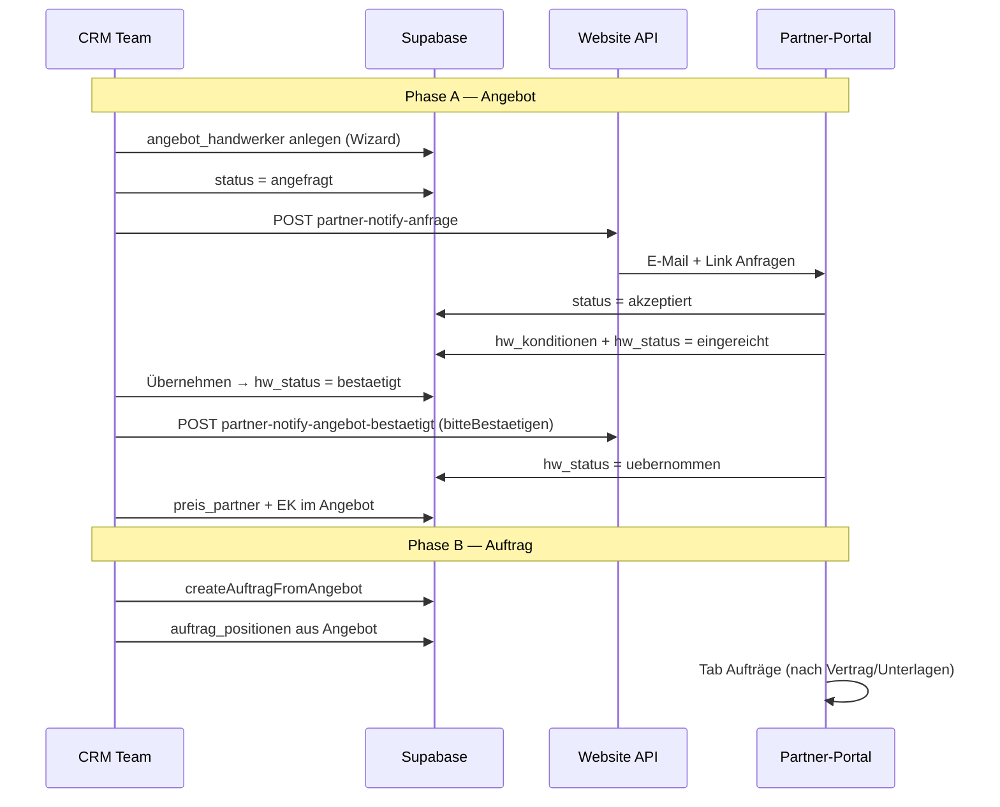
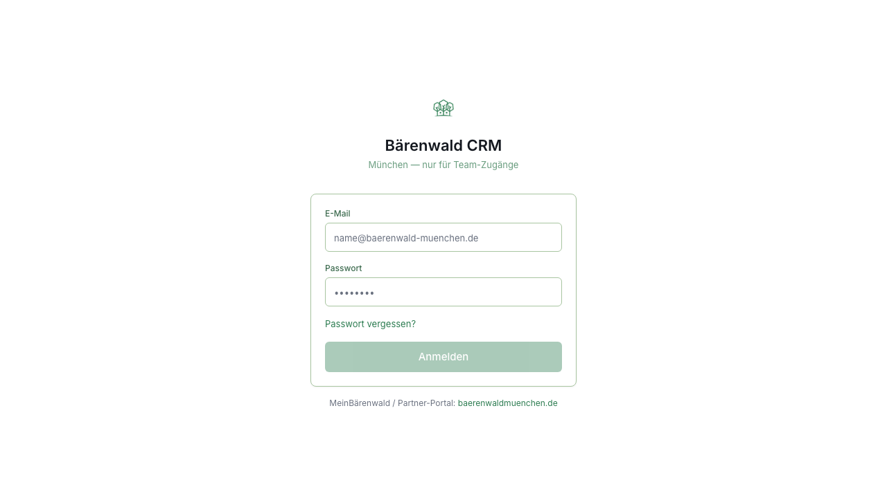

# Handwerker-Koordination — Gesamtprozess (CRM ↔ Partner-Portal)

**Stand:** Juni 2026  
**CRM-Repo:** `baerenwald-crm-dashboard`  
**Portal-Repo:** `handwerks-plattform` (Website `baerenwaldmuenchen.de/partner`)  
**Supabase-Projekt:** `wnotlydvhsmfkhexgeol`

Dieses Dokument beschreibt den **kompletten Lebenszyklus** einer Handwerker-Zuweisung: von der Angebots-Anfrage bis zur Ausführung und Nachreichung neuer Leistungen.

---

## 1. Zwei parallele Welten (wichtig!)

| Ebene | Tabelle / Feld | Bedeutung |
|-------|----------------|-----------|
| **Angebots-Funnel** | `angebot_handwerker` | Partner wurde am **Angebot** angefragt; Konditionen, PDF, `hw_status` |
| **Auftrags-Funnel** | `auftrag_positionen.handwerker_id` + `handwerker_status` | Partner ist einer **konkreten Leistung** am laufenden Auftrag zugewiesen |
| **Auftrags-Kopf** | `auftrag_handwerker` | Gewerk-Zuweisung auf Auftragsebene (Legacy/Übersicht) |
| **Baufortschritt** | `auftrag_positionen.leistung_status` | `offen` / `in_arbeit` / `erledigt` — **unabhängig** von Verhandlung |

**Regel:** „Akzeptiert“ auf `angebot_handwerker.status` = Partner hat die **Anfrage** angenommen, **nicht** dass Preise final vereinbart sind. Preise stecken in `hw_konditionen` / `hw_status`.

---

## 2. Status-Matrix

### `angebot_handwerker.status` (Portal-Antwort auf Anfrage)

| Wert | Bedeutung |
|------|-----------|
| `angefragt` | CRM hat angefragt, Partner hat noch nicht geantwortet |
| `akzeptiert` | Partner nimmt Zuweisung an (Portal) |
| `abgelehnt` | Partner lehnt ab |

### `angebot_handwerker.hw_status` (Konditionen / Verhandlung)

| Wert | CRM-Aktion | Portal-Phase |
|------|------------|--------------|
| `offen` / leer | Noch keine Einreichung | Angebote (nach Annahme) |
| `eingereicht` | Gegenvorschlag/Bestätigung wartet auf CRM | Angebote |
| `bestaetigt` | CRM hat **Übernehmen** geklickt; Partner muss im Portal bestätigen | Anfragen (Bestätigung) |
| `uebernommen` | Partner hat bestätigt; Preise verbindlich | Aufträge (nach weiteren Hürden) |
| `rueckfrage` | CRM hat Rückfrage gestellt | Angebote |
| `abgelehnt` | CRM hat abgelehnt | — |

### `auftrag_positionen.handwerker_status` (Zuweisung am Auftrag)

| Wert | Bedeutung |
|------|-----------|
| `angefragt` / `warten` | Zuweisung versendet, Antwort offen |
| `akzeptiert` | Partner hat zugewiesene Leistung angenommen |
| `abgelehnt` | Abgelehnt |

### `auftrag_positionen.leistung_status` (Bau)

`offen` → `in_arbeit` → `erledigt` (preisgewichteter Auftragsfortschritt)

---

## 3. Prozessdiagramm (Happy Path)



---

## 4. Schritt-für-Schritt

### Schritt 0 — Stammdaten

| Wo (CRM) | Aktion |
|----------|--------|
| `/handwerker` | Handwerker anlegen (Name, E-Mail, Gewerke, aktiv) |
| `/handwerker/[id]` | Portal-Zugang / Einladung |

**DB:** `handwerker`  
**Portal:** Registrierung nur nach Anlage im CRM (`/partner/register`)

---

### Schritt 1 — Angebot: Handwerker pro Gewerk zuweisen

| Wo (CRM) | Route / Komponente |
|----------|-------------------|
| Angebot-Wizard | `AngebotWizard` → Schritt Handwerker (`AngebotWizardHandwerkerStep.tsx`) |
| Angebot bearbeiten | `/angebote/[id]` |

**Aktion:** Pro Gewerk Handwerker auswählen, optional Aufgaben-Notiz.

**DB:**
```sql
INSERT angebot_handwerker (angebot_id, handwerker_id, gewerk_id, status, aufgabe_notiz)
-- status initial oft leer oder vorbereitet
```

**Portal:** Noch nichts sichtbar, bis Anfrage gesendet wird.

---

### Schritt 2 — Handwerker-Anfrage senden

| Wo (CRM) | Aktion |
|----------|--------|
| Angebot-Wizard „Senden“ oder Angebot-Detail | „Handwerker anfragen“ / E-Mail-Versand |

**Code:** `sendHandwerkerAnfrageFuerZuweisung()` → `lib/angebote/send-handwerker-anfrage.ts`

**DB-Update:**
```sql
UPDATE angebot_handwerker SET status = 'angefragt', gesendet_at = now()
```

**Was ins Portal geht:**

| Kanal | Details |
|-------|---------|
| API | `POST {SITE}/api/internal/partner-notify-anfrage` |
| Body | `{ "anfrageId": "<angebot_handwerker.id>" }` |
| Auth | `Bearer PARTNER_INTERNAL_API_SECRET` |
| Mail | Resend auf der **Website**, Link `?section=anfragen&id={uuid}` |

**Portal-Liste:** Tab **Anfragen** (`PARTNER_PORTAL_PHASEN.md`)



---

### Schritt 3 — Partner antwortet auf Anfrage

| Wo (Portal) | Aktion |
|-------------|--------|
| `/partner` → Anfragen | Annehmen oder Ablehnen |

**DB:**
```sql
UPDATE angebot_handwerker SET status = 'akzeptiert'|'abgelehnt', antwort_at = now()
```

**Portal:** Eintrag wandert von **Anfragen** → **Angebote** (bei Annahme).

**CRM:** Angebot-Detail zeigt Badge „Akzeptiert“ — **noch keine Konditionen**.

---

### Schritt 4 — Partner reicht Konditionen ein (Gegenvorschlag oder Bestätigung)

| Wo (Portal) | Aktion |
|-------------|--------|
| Tab **Angebote** | Preise je Leistung, PDF optional, „Senden“ |

**DB:**
```sql
UPDATE angebot_handwerker SET
  hw_konditionen = '{ art, positionen[], eingereicht_at }',
  hw_status = 'eingereicht',
  hw_eingereicht_at = now(),
  hw_preis_netto / hw_preis_brutto
```

**JSON `hw_konditionen` (Beispiel):**
```json
{
  "art": "gegenvorschlag",
  "positionen": [
    { "position_id": "...", "leistung": "Wandfliesen", "ek_netto": 500, "hw_netto": 750, "geaendert": true }
  ]
}
```

**CRM:** Noch keine automatische Mail — Eintrag erscheint zur Prüfung am Auftrag/Angebot.

---

### Schritt 5 — CRM prüft Konditionen

| Wo (CRM) | Route |
|----------|-------|
| Auftrag → Tab **Leistungen & Steuerung** | Position aufklappen → Tab **Handwerker & Verhandlung** |
| Oder Angebot-Detail | `HandwerkerEinreichungPruefung.tsx` |

**Komponenten:**
- `HwKonditionenPruefungTable.tsx` — Tabelle Vorschlag vs. Vergütung vs. Δ
- Aktionen: **Übernehmen** | **Rückfrage** | **Ablehnen**

**Code Übernehmen:** `bestaetigeHandwerkerEinreichung()` → `uebernehmeHandwerkerEinreichungEk()`

**DB nach Übernehmen:**
```sql
-- Angebot: einkaufspreis in positionen[]
-- Auftrag: preis_partner auf passenden auftrag_positionen
UPDATE angebot_handwerker SET hw_status = 'bestaetigt', hw_crm_antwort_at = now()
```

**Was ins Portal geht:**

| API | `POST partner-notify-angebot-bestaetigt` |
| Body | `{ "anfrageId": "...", "bitteBestaetigen": true }` |
| Mail | Link zu Anfragen — Partner soll Konditionen **bestätigen** |

---

### Schritt 6 — Partner bestätigt übernommene Konditionen

| Wo (Portal) | Aktion |
|-------------|--------|
| Anfragen / Bestätigungsflow | „Bestätigen“ |

**DB:**
```sql
UPDATE angebot_handwerker SET hw_status = 'uebernommen'
```

**CRM:** Badge **Übernommen**; `preis_partner` gesetzt; Zeile zeigt vereinbarten EK.

---

### Schritt 7 — Kunde akzeptiert → Auftrag anlegen

| Wo (CRM) | Aktion |
|----------|--------|
| Angebot-Detail | „Auftrag anlegen“ |

**Code:** `createAuftragFromAngebot()` in `angebote/actions.ts`

**DB:**
- `auftraege` INSERT
- `auftrag_positionen` aus `angebote.positionen` (via `angebotPositionenToAuftragRows`)
- `auftrag_handwerker` für akzeptierte Gewerke
- Eingereichte Konditionen werden auf Positionen angewendet (EK/`preis_partner`)

**Hinweis:** Wenn `hw_status` beim Anlegen noch nicht `uebernommen`, kann der Flow `bestaetigt` überspringen — bekanntes Risiko.

---

### Schritt 8 — Handwerker direkt am Auftrag zuweisen (ohne Angebots-Funnel)

| Wo (CRM) | Aktion |
|----------|--------|
| Auftrag → Leistungen | „Handwerker fürs Gewerk“ oder Dropdown pro Position |
| Modal | `HandwerkerZuweisenModal.tsx` |

**Code:** `assignAuftragHandwerkerGewerk()` / `assignAuftragHandwerkerPosition()`  
**DB:** `auftrag_positionen.handwerker_id`, `handwerker_status = angefragt`

**Was ins Portal geht (wenn implementiert):**

| API | `POST partner-notify-zuweisung` |
| Body | `{ auftragId, handwerkerId, positionIds? }` |
| Link | `?section=anfragen&id=auftrag:{auftragId}` |

**Portal:** Erscheint unter **Anfragen** (nicht Aufträge), solange `auftraege.status = offen`.

---

### Schritt 9 — Neue Leistung nachrüsten (Nachreichung)

| Wo (CRM) | Aktion |
|----------|--------|
| Auftrag → Gewerk | „Leistung hinzufügen“ |
| Oder | Angebot-Korrektur-Wizard → Sync |

**Code:** `addAuftragPosition()` — erbt automatisch `handwerker_id` von Geschwister-Positionen (`auftrag-position-handwerker-erbe.ts`)

**Voraussetzungen Portal-Erkennung:**

| Feld | Wert |
|------|------|
| `angebot_handwerker.hw_status` | `uebernommen` |
| `hw_konditionen` | gesetzt (alte Positionen) |
| Neue Zeile | in `auftrag_positionen` **oder** `angebote.positionen` |
| Zuordnung | `handwerker_id` + `gewerk_slug`/`gewerk_name` |
| `angebot_handwerker.gewerk_id` | gesetzt (CRM backfill bei Zuweisung) |

**Portal:** Neue Leistung erscheint unter **Anfragen** als Nachreichung (Delta zu `hw_konditionen`).

**Nicht** bei `hw_status = bestaetigt` oder `eingereicht` ohne vorherige Einigung — dann normaler Anfragen-Flow.

---

### Schritt 10 — Baufortschritt (getrennt)

| Wo (CRM) | Tab **Termine & Fortschritt** |
|----------|--------------------------------|
| Segmented Control | Offen / In Arbeit / Erledigt |

**Code:** `updateAuftragPositionLeistungStatus()`  
**DB:** `auftrag_positionen.leistung_status` → synchronisiert `auftraege.fortschritt`

**Portal:** Kein direkter Push — nur indirekt über Projektstatus.

---

## 5. API-Übersicht CRM → Website

| Endpoint | Wann | Datei |
|----------|------|-------|
| `partner-notify-anfrage` | HW-Anfrage am Angebot | `notify-partner-anfrage.ts` |
| `partner-notify-zuweisung` | Zuweisung am Auftrag | `notify-partner-zuweisung.ts` |
| `partner-notify-angebot-bestaetigt` | Nach CRM-Übernehmen | `notify-partner-angebot-bestaetigt.ts` |
| `partner-notify-angebot-antwort` | Rückfrage/Ablehnung | `notify-partner-angebot-antwort.ts` |

**Env (identisch CRM + Netlify):** `PARTNER_INTERNAL_API_SECRET`, `NEXT_PUBLIC_SITE_URL`

---

## 6. Referenz-Auftrag (Test)

| Entität | ID |
|---------|-----|
| Auftrag | `a5ebfa7d-b77a-4109-b68b-873896734f5d` |
| Zuweisung | `3b7768c4-b2c5-469b-9acf-0cd8f5495b54` |
| Handwerker | Bärenwald München |
| Stand (DB) | `hw_status=eingereicht`, Gegenvorschlag 750 € netto |

---

## 7. Bekannte Lücken / Risiken

1. **Zwei Status-Ebenen** verwirren Nutzer („Akzeptiert“ ≠ Preis OK).
2. **`notify-partner-zuweisung`** war lange nicht überall angebunden.
3. **`createAuftragFromAngebot`** kann `hw_status` direkt auf `uebernommen` setzen und `bestaetigt` überspringen.
4. **Angebot-Korrektur** schreibt primär `angebote.positionen` → Sync zu Auftrag; direktes „Leistung hinzufügen“ nur `auftrag_positionen`.
5. **UI** — siehe `HANDWERKER_KOORDINATION_UI_ANALYSE.md` (Accordion-Problem, Redesign v2).

---

## 8. Datei-Index (CRM)

| Bereich | Pfad |
|---------|------|
| Positions-Tab | `src/components/auftraege/AuftragPositionenSteuerungTab.tsx` |
| Zeile v2 | `src/components/auftraege/AuftragPositionRowSummary.tsx` |
| Detail 3 Tabs | `src/components/auftraege/AuftragPositionDetailPanel.tsx` |
| Konditionen prüfen | `src/components/angebote/HandwerkerEinreichungPruefung.tsx` |
| HW-Zuweisung | `src/app/(dashboard)/auftraege/handwerker-actions.ts` |
| EK übernehmen | `src/app/(dashboard)/angebote/actions.ts` |
| Handwerker erben | `src/lib/auftraege/auftrag-position-handwerker-erbe.ts` |
| Konditionen-Schema | `src/lib/partner/hw-konditionen.ts` |

**Portal-Docs:** `handwerks-plattform/docs/PARTNER_PORTAL_PHASEN.md`, `PARTNER_CRM_NOTIFY_API.md`
