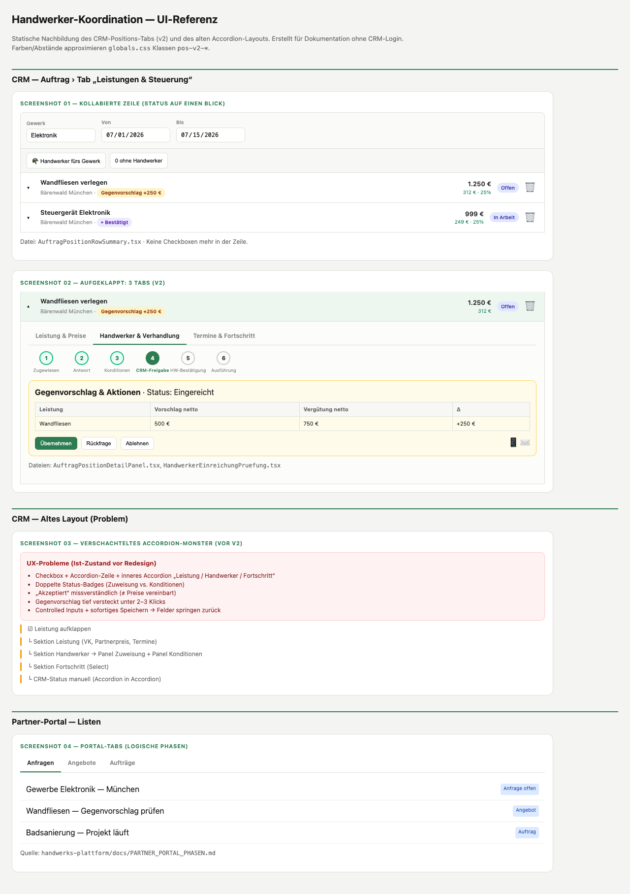
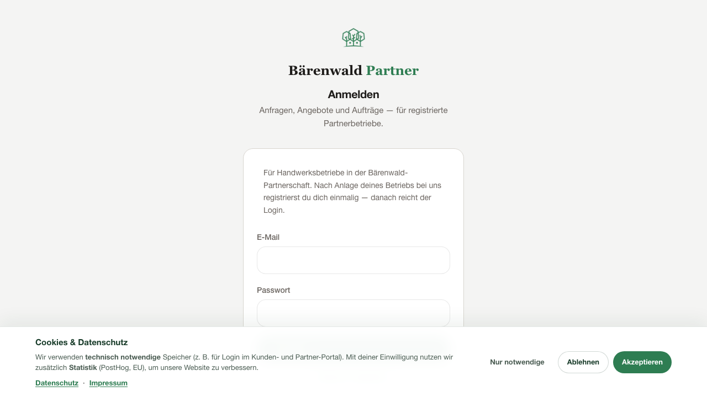

# Handwerker-Koordination — UI/UX-Analyse & Ist-Zustand

**Stand:** Juni 2026  
**Ziel:** Vollständige Bestandsaufnahme des CRM-Interfaces und des Partner-Portals für die Neugestaltung der Positions-Steuerung.

**Screenshots:** Ordner `docs/handwerker-koordination/screenshots/`  
*(Ohne CRM-Login erstellt via Playwright + statische UI-Referenz)*

---

## Executive Summary

Die Handwerker-Koordination ist **fachlich komplex** (zwei Status-Ebenen, zwei Datenquellen, sechs Pipeline-Schritte), das Interface hat das **visuell nicht getragen**:

| Problem | Schwere |
|---------|---------|
| Verschachtelte Accordions (Zeile → Sektionen → Panels → Advanced) | Kritisch |
| Status-Badges konkurrieren (Zuweisung vs. Konditionen vs. Bau) | Hoch |
| Gegenvorschlag erst nach 3+ Klicks sichtbar | Hoch |
| Checkbox + Accordion + Gewerk-Toolbar (3 Wege dieselbe Aktion) | Mittel |
| Mobile vs. Desktop unterschiedliche Patterns | Mittel |

**Empfehlung:** Positions-Tab **komplett neu** — keine Accordions; eine Zeile = ein Status; aufgeklappt = **3 Tabs** (bereits als v2 begonnen, aber noch nicht überall konsistent / Mobile fehlt).

---

## Screenshots-Übersicht

| Datei | Inhalt |
|-------|--------|
| `00-crm-login.png` | CRM-Login (`localhost:3001/login`) |
| `01-crm-positionen-v2-referenz.png` | UI-Referenz: kollabierte Zeilen + 3 Tabs + Pipeline (statisch) |
| `02-partner-login.png` | Partner-Portal Login (`baerenwaldmuenchen.de/partner/login`) |

> **Hinweis:** Echte eingeloggte CRM-Screenshots erfordern Team-Zugangsdaten. Die Referenz `ui-referenz.html` bildet den **aktuellen v2-Code** nach (`pos-v2-*` CSS). Nach Login können identische Views unter `/auftraege/{id}` → Tab „Leistungen“ fotografiert werden.

---

## 1. CRM — Informationsarchitektur Auftrag

```
AuftragDetailClient
└── Tab „Leistungen & Steuerung“
    └── AuftragPositionenSteuerungTab
        ├── Kopf: Summen (VK, EK, Marge)
        ├── Gewerk-Gruppe (GewerkBlock)
        │   ├── Gewerk-Head (Name, Von/Bis)
        │   ├── Toolbar: Handwerker fürs Gewerk | X ohne Handwerker
        │   └── LeistungRow × n
        │       ├── AuftragPositionRowSummary  ← NEU v2
        │       └── AuftragPositionDetailPanel ← NEU v2 (3 Tabs)
        ├── HandwerkerZuweisenModal
        └── HandwerkerZuweisungMailModal
```

**Parallel (alt, noch vorhanden):**
- `AuftragPositionenLeistungEdit.tsx` — monolithisches Accordion-Panel (Mobile nutzt Teile davon)
- `AuftragPositionHandwerkerPanel.tsx` — eingebettet im Tab „Handwerker & Verhandlung“

---

## 2. Ist-Zustand vs. Ziel v2

### 2.1 Kollabierte Zeile



**Ziel v2 (implementiert Desktop):**

| Spalte | Inhalt |
|--------|--------|
| Chevron | Auf-/Zuklappen |
| Haupt | Name + Meta-Zeile: `Handwerker · Badge` |
| Preise | VK + Marge % |
| Pill | Baufortschritt (Offen/In Arbeit/Erledigt) |
| Löschen | Icon |

**Badge-Beispiele** (`position-handwerker-view.ts`):
- `Gegenvorschlag +250 €`
- `⏵ Bestätigt` (CRM übernommen, wartet HW)
- `Übernommen`
- `Warte Antwort`

**Entfernt:** Zeilen-Checkboxen (Bulk nur noch über Gewerk-Toolbar).

---

### 2.2 Aufgeklappt — 3 Tabs (Ziel)

| Tab | Inhalt | CRM-Aktion |
|-----|--------|------------|
| **Leistung & Preise** | Name, Beschreibung, VK, Partnerpreis (read-only bei Verhandlung), Live-Marge-Leiste | `updateAuftragPositionSteuerung` on blur |
| **Handwerker & Verhandlung** | Pipeline ①–⑥, HW-Dropdown, WA/Mail, Gegenvorschlag-Tabelle, Übernehmen/Rückfrage/Ablehnen | `HandwerkerEinreichungPruefung`, `assignAuftragHandwerkerPosition` |
| **Termine & Fortschritt** | Segmented Baufortschritt, Von/Bis, Notizen | `updateAuftragPositionLeistungStatus` |

**Auto-Tab:** Bei offenem Gegenvorschlag → Tab „Handwerker & Verhandlung“.

---

### 2.3 Altes Layout — warum es nicht funktioniert

```
[☑] [▾ Leistungsname                    1.250 € 🗑]
    ┌─ Accordion Body ─────────────────────────────┐
    │ Sektion LEISTUNG (6 Felder inkl. Termine!)   │
    │ Sektion HANDWERKER                           │
    │   └ Panel Zuweisung (+ CRM-Status Accordion) │
    │   └ Panel Konditionen & Verhandlung          │
    │        └ HandwerkerEinreichungPruefung       │
    │ Sektion FORTSCHRITT (Select)                 │
    └──────────────────────────────────────────────┘
```

**Nutzer-Feedback (berechtigt):**
1. Termine gehören nicht unter „Leistung“ wenn es auch „Fortschritt“ gibt.
2. „Akzeptiert“-Badge neben leerem Partnerpreis wirkt wie „fertig“.
3. Gegenvorschlag in amber Box **unter** zwei anderen Panels.
4. Tippen in VK-Feld → sofort `router.refresh()` → Werte springen (behoben via draft+onBlur, aber Pattern war frustrierend).

---

## 3. Schritt-für-Schritt: Wo klickt wer?

### Phase Angebot (CRM)

| Schritt | UI-Ort | Screenshot |
|---------|--------|------------|
| HW zuweisen | Angebot-Wizard, Schritt Handwerker | *(Login nötig)* |
| Anfrage senden | Wizard Senden / Angebot-Detail | *(Login nötig)* |
| Einreichung prüfen | `/angebote/[id]` HW-Bereich | *(Login nötig)* |

### Phase Auftrag (CRM)

| Schritt | UI-Ort | Komponente |
|---------|--------|------------|
| Alle Leistungen | `/auftraege/[id]` → Tab Leistungen | `AuftragPositionenSteuerungTab` |
| HW fürs Gewerk | Gewerk-Toolbar | `HandwerkerZuweisenModal` |
| Gegenvorschlag | Zeile aufklappen → Tab HW | `HwKonditionenPruefungTable` |
| Übernehmen | Gleicher Tab, Buttons | `HandwerkerEinreichungPruefung` |
| Neue Leistung | „+ Leistung hinzufügen“ | erbt `handwerker_id` automatisch |
| Baufortschritt | Tab Termine | Segmented Control |

### Phase Portal (Handwerker)



| Schritt | UI-Ort | Daten |
|---------|--------|-------|
| Login | `/partner/login` | Supabase Auth |
| Anfrage annehmen | Tab **Anfragen** | `angebot_handwerker.status` |
| Konditionen senden | Tab **Angebote** | `hw_konditionen`, `hw_status=eingereicht` |
| Konditionen bestätigen | Tab **Anfragen** (nach CRM) | `hw_status=bestaetigt` → `uebernommen` |
| Projekt ausführen | Tab **Aufträge** | nach Vertrag/Unterlagen |

---

## 4. Visuelles Design (aktuell)

### Design-Tokens (aus `globals.css`)

| Token | Verwendung |
|-------|------------|
| `--bw-primary` / `#2e7d52` | Buttons, aktive Pipeline |
| `pos-v2-badge-warn` | Gegenvorschlag (amber) |
| `pos-v2-badge-violet` | Bestätigt / wartet HW |
| `leistung-badge-*` | Baufortschritt-Pill |
| `gewerk-group` | Gewerk-Container mit Head + Toolbar |

### Konsistenz-Probleme

- Angebot-Wizard nutzt **andere** HW-UI als Auftrag-Tab.
- Mobile (`AuftragPositionenMobile.tsx`) noch **Checkbox + altes Summary**.
- `AuftragPositionenTab.tsx` (älterer Tab?) existiert parallel — Verwirrung im Code.

---

## 5. Pipeline-Stepper (neu)

```
① Zugewiesen → ② Antwort → ③ Konditionen → ④ CRM-Freigabe → ⑤ HW-Bestätigung → ⑥ Ausführung
```

**Logik:** `buildPositionHandwerkerView()` in `position-handwerker-view.ts`

| Schritt aktiv wenn… |
|---------------------|
| ① | `handwerker_id` gesetzt |
| ② | `angefragt` / `warten` |
| ③ | Partner `akzeptiert`, noch keine Einreichung |
| ④ | `hw_status=eingereicht` |
| ⑤ | `hw_status=bestaetigt` |
| ⑥ | `uebernommen` oder Bau `in_arbeit`/`erledigt` |

---

## 6. Redesign-Empfehlung (nächste Iteration)

### Must-Have

1. **Ein Pattern überall** — Desktop v2 auch auf Mobile; `AuftragPositionenLeistungEdit` deprecaten.
2. **Zeile = Dashboard** — Alle entscheidungsrelevanten Infos ohne Aufklappen.
3. **Tab 2 = Verhandlungs-Cockpit** — Tabelle + Aktionen above the fold; kein Nested Accordion.
4. **Status-Glossar** — Inline-Hilfe: „Akzeptiert = Anfrage, nicht Preis“.
5. **Angebot ↔ Auftrag** — Gleiche HW-Komponente in Angebot-Detail und Auftrag-Tab.

### Nice-to-Have

- Notification-Banner auf Auftragsebene: „2 Gegenvorschläge offen“
- Bulk-Aktion „Alle Gegenvorschläge übernehmen“
- Deep-Link vom Portal-Fehler ins CRM (`?position=uuid&tab=handwerker`)

### Wireframe-Ziel (kein Accordion)

```
┌─ Gewerk: Elektronik ──────────────────── [HW fürs Gewerk] ─┐
│ ▾ Wandfliesen · HW Name · [Gegenvorschlag +250€]  1.250€  │
│   [Leistung&Preise] [Handwerker&Verhandlung*] [Termine]    │
│   ①──②──③──④──⑤──⑥                                        │
│   ┌─ Gegenvorschlag-Tabelle ──────────────────────────┐  │
│   │ [Übernehmen] [Rückfrage] [Ablehnen]    📱 ✉️       │  │
│   └────────────────────────────────────────────────────┘  │
└──────────────────────────────────────────────────────────┘
```

---

## 7. Was ohne Login fehlt / Nachlieferung

Folgende Screenshots sollten mit **Team-Login** ergänzt werden:

- [ ] `/auftraege/a5ebfa7d-…` Tab Leistungen (kollabiert)
- [ ] Dieselbe Position aufgeklappt, Tab HW, Gegenvorschlag sichtbar
- [ ] Nach „Übernehmen“ — Badge `⏵ Bestätigt`
- [ ] Angebot-Wizard Handwerker-Schritt
- [ ] Portal Tab Anfragen / Angebote (Partner-Login)

**Schnelltest nach Login:**
```
http://localhost:3001/auftraege/a5ebfa7d-b77a-4109-b68b-873896734f5d
→ Tab „Leistungen & Steuerung“
```

---

## 8. Verwandte Dokumente

- [HANDWERKER_KOORDINATION_PROZESS.md](./HANDWERKER_KOORDINATION_PROZESS.md) — Fachlicher Ablauf & APIs
- [ui-referenz.html](./ui-referenz.html) — Statische UI-Nachbildung zum Selbst-Screenshot
- `handwerks-plattform/docs/PARTNER_PORTAL_PHASEN.md`
- `handwerks-plattform/docs/PARTNER_CRM_NOTIFY_API.md`
